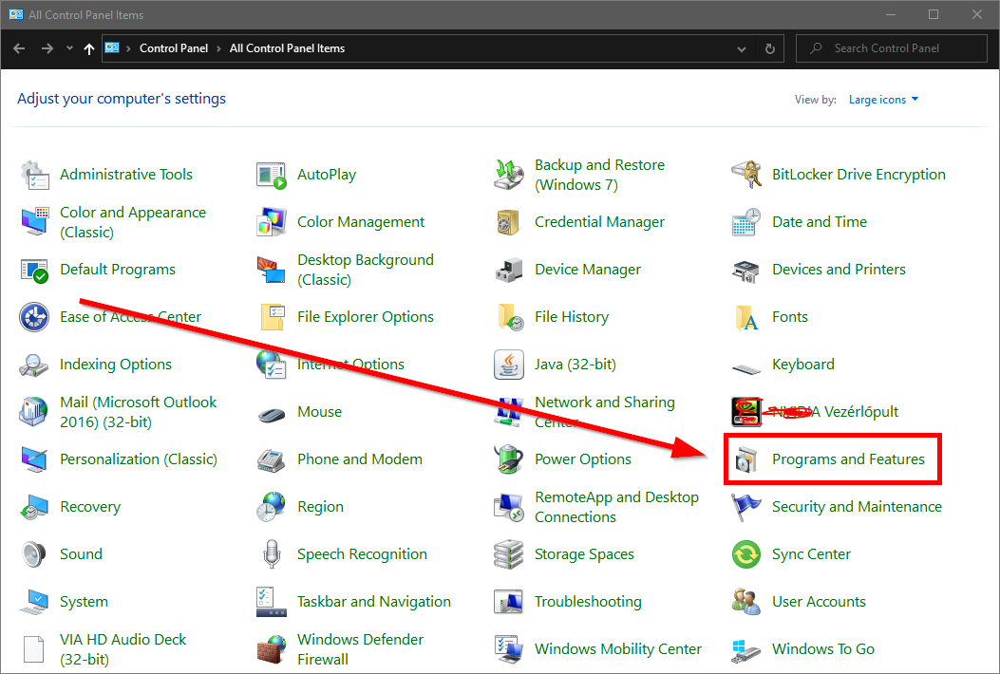
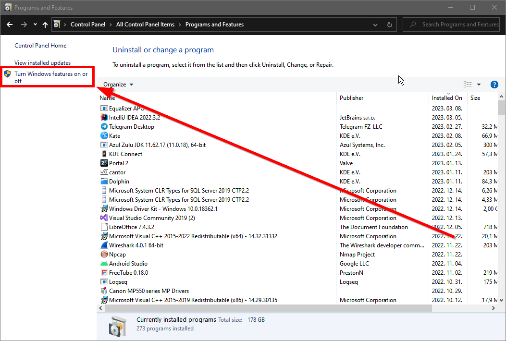
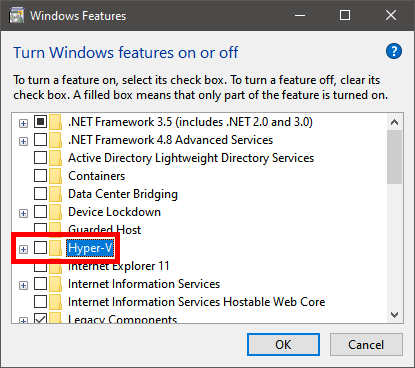
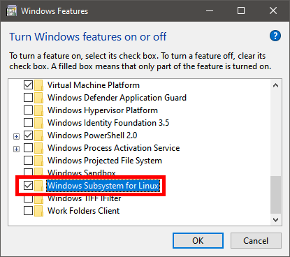

Docker, when ran on Windows, requires enabling the features corresponding to the virtualization backend to be used.  
If you are using Linux, you don't have to do anything similar, as virtualization does not happen there.

## 1. Select the "Programs and Features" control panel item

On Hungarian systems, this is called "Programok és szolgáltatások".

## 2. Click on "Turn Windows features on or off"

On Hungarian systems, this is called "Windows-szolgáltatások be- és kikapcsolása".

## 3. Tick the boxes for the features

You may only need one of them depending on the virtualization backend you will choose in the Docker Desktop installer.

|Hyper-V|WSL|
|---|---|
|||

When you click OK, Windows will install a few things. Make sure you have an internet connection.
