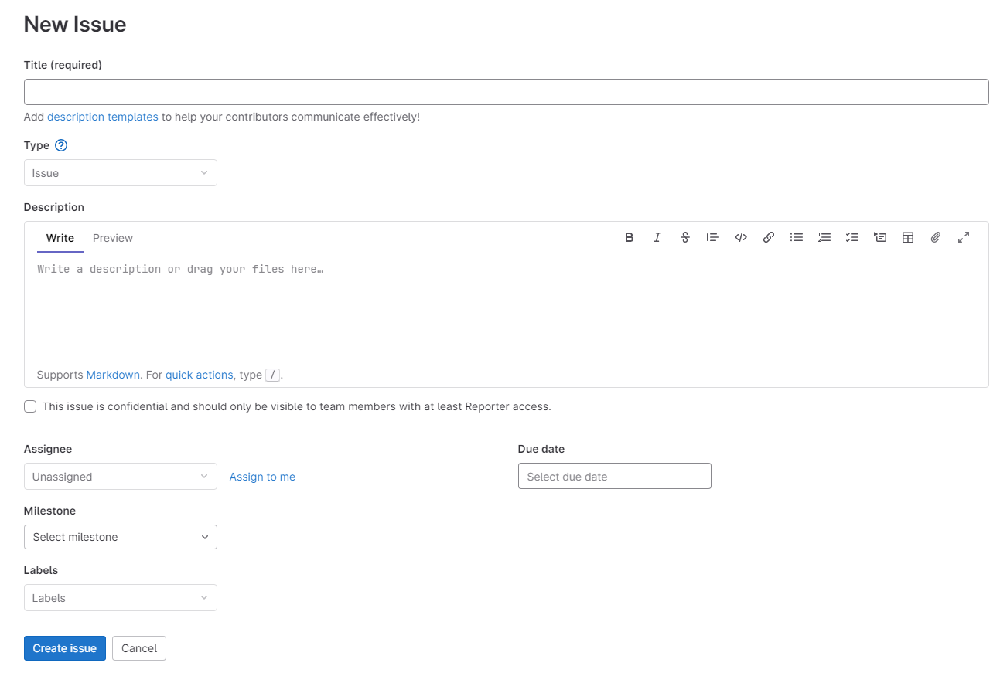
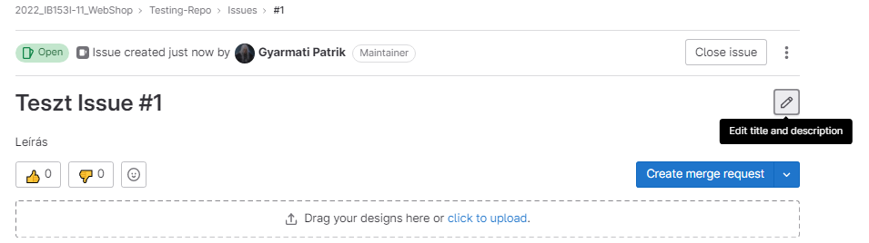
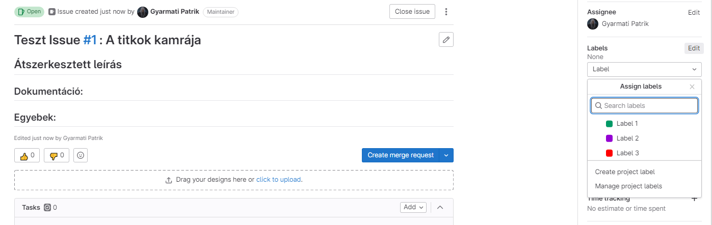
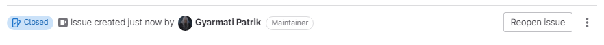
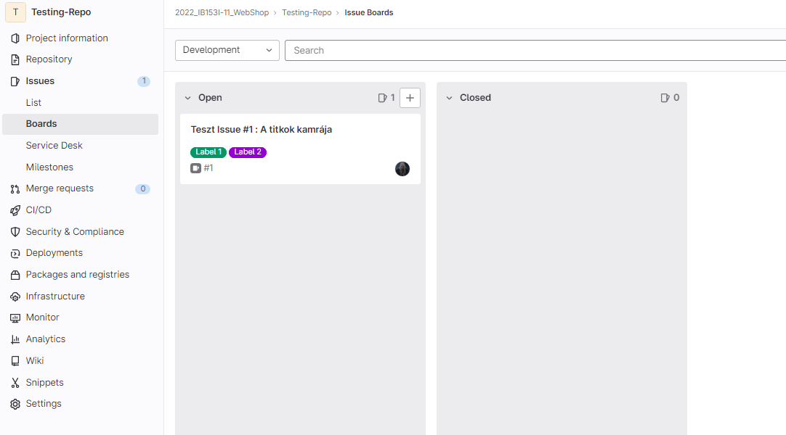
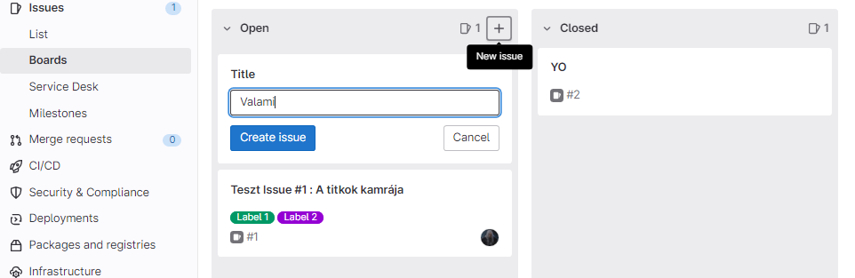
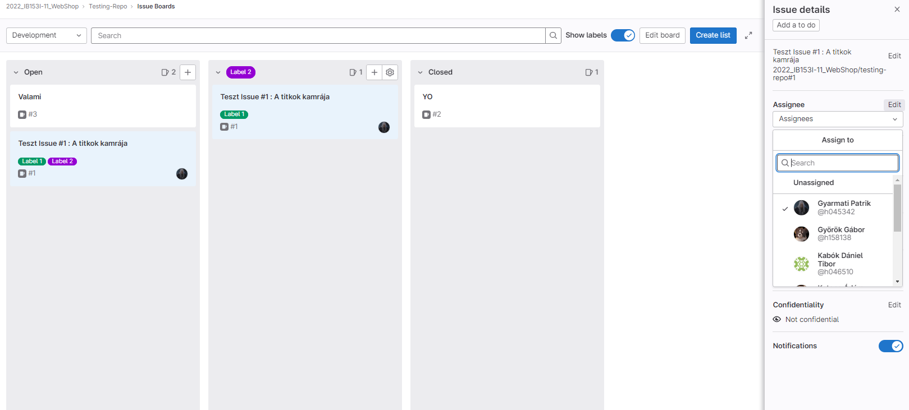

## Bevezetés az Issue-kezelésbe
### Mi az Issue-kezelés?
Az issue-kezelés egy olyan folyamat, amely segít azonosítani, dokumentálni és nyomon követni azon problémákat, amelyekkel egy projekt vagy szoftverfejlesztés során találkozhatunk. Ez lehetnek hibák, javaslatok, fejlesztési igények, technikai problémák vagy bármilyen más kihívás, amelyek hatással lehetnek a projekt előrehaladására.

Az issue-kezelő rendszerek lehetővé teszik a csapatoknak, hogy az összes problémát egy központi helyen kezeljék, és nyomon kövessék a fejlesztési folyamatban történő előrehaladást.
A [GitLab](https://about.gitlab.com/) is tartalmaz issue-kezelő funkciókat a projektekben.

### Miért hasznos az Issue-kezelés?
Az issue-kezelés segítségével a csapat tagjai könnyen tudják jelenteni a problémákat, majd azokat azonnal dokumentálni és követni a megoldásukig. Az issue-ek rendelkezhetnek prioritással, határidővel, felelős személlyel és más metaadatokkal, amelyek segítenek a csapatnak a problémák hatékony kezelésében és megoldásában.

Az issue-kezelés fontos eszköz a hatékony projektmenedzsmenthez és a problémák hatékony kezeléséhez. A GitLab issue-kezelő funkciói lehetővé teszik a csapatok számára, hogy ezt az eszközt hatékonyan használják a projektfejlesztés során.

### Hogyan lehet elérni az Issue-kat a GitLab-on keresztül?
Az issue-k eléréséhez először be kell jelentkezni a GitLab-fiókba, majd válasszuk ki a megfelelő projektet. A projekt oldalán a navigációs sávban kattintsunk az `Issues` menüpontra.

Itt megjelenik az összes issue a projektben, amelyeket szűrhetünk a különböző attribútumok alapján, a könnyebb eligazodás érdekében.
A következő attribútumokra lehet szűrni:
* Assignee
* Author
* Confidential (yes/no)
* Label
* Milestone
* My-Reaction
* Release
* Type

Ezen felül még létezik a `Search Wtihin` ahol szövegrészletre lehet keresni a címekben vagy a leírásokban.

## Hogyan lehet létrehozni egy Issue-t?

A projekt oldalán válasszuk ki az `Issues` menüpontot, majd kattintsunk jobb felül a `New Issue` gombra, hogy elkezdjük az új Issue létrehozását.

A következő Issue-t létrehozó felület jön elő:

###  Issue tulajdonságai

Az alábbiakat lehet megadni:

* **Title**: Az Issue címe, amely rövid és informatív leírást ad az Issue-ról.

* **Description**: Részletes leírás az Issue-ról, hogy mikor és pontosan hogyan működjün az Issue-ban leírtak. A leírás támogatja a [Markdown](https://www.markdownguide.org/) formázást. A Markdown segítségével könnyedén formázhatjuk az Issue leírását a szöveg és a bekezdések formázásához, címek, lista és táblázatok készítéséhez.

* **Labels**: Az Issue-hoz tartozó címkék, amelyek segíthetnek az Issue könnyebb azonosításában és kategorizálásában. Minden label-hez rendelhető egy szín is, alapból 21 színből lehet választani, de HEX color code-al egyedi is megadható.

* **Assignee**: Be lehet állítani a felelős személyt az Issue-ra, GitLab esetén csak 1 fő tartozhat 1 Issue-hoz.

* **Milestones**: Az Issue-hoz tartozó mérföldkövek. Milestone-okat külön kell létrehozni, hozzájuk rendelhető: `Title`, `Start Date`, `Due Date`  és maga az Issue-hoz hasonlóan egy `Description`.

* **Due date**: Az Issue-hoz tartozó határidő.

* **Csatolmányok**: Az Issue-hoz tartozó fájlok. A csatolmányokat az Issue alatt lehet feltölteni és ott is jelennek meg a fájlok előnézeteivel.

###  Issue elkészülte

Miután beállítottunk mindent, kattintsunk a `Submit issue` gombra, hogy létrejöjjön az új Issue.

Az Issue létrehozása után a fejlesztők megkezdhetik az Issue megcsinálását, és a címzettek kapnak értesítést az Issue-ról. Az Issue-kat később is szerkeszthetjük vagy frissíthetjük a `Issues` oldalon keresztül.

## Hogyan kell módosítani egy Issue-t?

Egy issueban sok féle dolgot tudunk módosítani, ez függ a GitLab verziónktól és a jogainktól is mint felhasználó vagy fejlesztő az adott projectben.

### Hogyan lehet frissíteni a címet és a leírást?

1. Lépjünk be a GitLab fiókunkba és nyissuk meg az adott projektet.
2. Kattintsunk az "Issues" fülre.
3. Kattintsunk az általunk szerkeszteni kívánt Issue-ra.
4. Kattintsunk az "Edit title and description" gombra az Issue oldalán.

5. Szerkesszük a címet és/vagy a leírást az adott mezőben.
6. Kattintsunk a "Save changes" gombra.

### Hogyan lehet módosítani a címkéket, a felelősöket és a határidőket?

1. Kattintsunk az általunk szerkeszteni kívánt Issue-ra.
2. Jobb oldalt a szerkeszteni kívánt 'Assignee', 'Labels', 'Due date' fülek nyomjuk meg ad 'Edit' gombot

3. Válasszuk ki a megfelelő címkéket amiket szeretnénk hozzáadni az issuenkhoz majd kattintsunk ki.
4. Hasonló módon szerkeszthetjük a többi issuenkhoz tartozó információt mint például: Milestone, Time tracking, Condidentiality, Lock issue, stb...
### Hogyan lehet lezárni vagy újranyitni egy Issue-t?

1. Kattintsunk az általunk szerkeszteni kívánt Issue-ra.
2. Az issue címe felett található egy 'Close issue' vagy 'Reopen issue' gomb

3. Megnyomásával az issuet le tudjuk zárni vagy már lezárt issuet újranyitni.

## Hogyan kell használni az Issue Boards-ot?

1. Lépjünk be a GitLab fiókunkba és nyissuk meg az adott projektet.
2. Bal oldalt az 'Issues' fülre rákattintva vagy ráhúzva az egeret láthatunk egy 'Boards' opciót
3. A 'Boards' fülre kattintva juthatunk ell a projekt Issue Boards-ához

### Mi az Issue Boards és hogyan működik?

Az Issue Boards egy eszköz, amely segítségével vizualizálhatjuk az Issue-k állapotát a GitLab projektben. Az Issue-kat oszlopokba rendezhetjük aszerint, hogy melyik állapotban vannak, például "To do", "In progress", "Done", stb.

### Hogyan lehet hozzáadni és eltávolítani Issue-kat az Issue Boards-ból?
A Boards azokat az issuekat jeleníti meg amelyek szerepelnek a projektünkben, így ha hozzáadunk vagy kitörlünk bármilyen issuet akkor a Boardson is látszódni fog a változás.

Az Issue-k hozzáadásához és eltávolításához az Issue Boards-ból a következő lépéseket kell követni:

1. Nyissaukmeg az Issue Boards-ot a projekt oldalán.
2. Válasszuk ki azt a kategóriát, amelyhez hozzá szeretnénk adni az Issue-t.
3. Kattintsunk a „+” gombra, majd írjuk be az issue címét amelyet hozzá szeretnénk adni.

4. A kiválasztott Issue hozzáadódik a kategóriához.
5. Az Issue eltávolításához egyszerűen húzzuk ki azt a kategóriából.
6. Ha magát az egész issuet szeretnénk kitörölni a projektből, akkor erre az egyetemi verzión még sajnos nincs lehetőség.

### Hogyan lehet módosítani az Issue-kat az Issue Boards-on?

Az issuekat az Issue Boards oldalon is tudjuk módosítani, ehhez annyi a teendőnk hogy kattintsunk a szerkeszteni kívánt issuenkra, miután ezt megtettük oldalt megjelenik egy 'Issue details' fül, itt az 'Edit' gombra kattintva tudjuk módosítani az:

1. Issue címét
2. Hozzárendelt embert
3. A mérföldkövet
4. Time trackinget
5. Határidőt
6. Címkéket
7. Láthatóságot

