# Bevezetés a Wikibe

### Mire jó a Wiki oldal?

A Wiki oldalak segítségével különböző `Markdown` formátumú leírásokat adhatunk hozzá a projektünkhöz. 

## Miért hasznos a Wiki oldal?

A Wiki segítségével a projektmenedzsment dolgát lehet megkönnyíteni, itt el tudunk készíteni meeting memokat, fejlesztési terveket, különböző összegző dokumentumokat, illetve a tesztelés dokumentálása is történhet.

## Hogyan lehet elérni a Wiki-t a GitLab-on keresztül?

Az issue-k eléréséhez először be kell jelentkezni a GitLab-fiókba, majd válasszuk ki a megfelelő projektet. A projekt oldalán a navigációs sávban kattintsunk az `Wiki` menüpontra.

Itt megjelenik az összes Wiki oldal a projekthez kapcsolódóan.
Ahol:
- létre tudunk hozni új Wiki oldalt
- böngészni tudunk az eddig hozzáadott Wiki oldal között

# Hogyan lehet létrehozni egy Wikit-t?

A projekt oldalán válasszuk ki az `Wiki` menüpontot, amennyiben létezik a `Home` wiki, úgy a jobb felső sarokban a `New page` gombbal tudunk létrehozni.

Ha nem létezik még `Home` wiki oldal, akkor alapértelmezettként új wiki oldal létrehozásához szükséges felület tölt be.

##  Wiki tulajdonságai

A Wiki egy alapvetően `Markdown`-t támogató formátumban készülő dokumentum, de ez szükség szerint lehet:
- RDOC
- AsciiDoc
- Org

formátum is.

##  Wiki elkészülte

Miután beállítottunk a formátumot, megadtuk neki a címet, illetve a commit üzenet részt is kitöltöttük, kattintsunk a `Create changes` gombra, hogy elmentsük, és feltöltsük a projektünkhöz az új Wiki oldalt.

## Hogyan lehet módosítani egy Wiki oldalt?

A már létező oldalon jobb felül a kis ceruza ikonra kattintva elérhetővé válik a szerkesztő (ugyanúgy néz ki, mint az új wiki szerkesztője)

##Milyen formázási lehetőségek vannak?

### Címsor formázás

`#` jellel történik, minél kevesebb, annál nagyobb szintű  
Helyes szintaxisa `# Szöveg` (a `#Szöveg nem konvencionális`)
Illetve a `#` tartalmazó sor előtt és után is egy üres sor hagyandó.

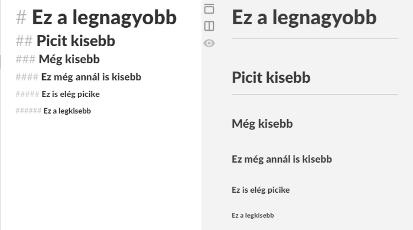

### Bekezdés formázása

Szimplán egy üres sor a két szöveg között (ne használjunk tabulálást a sor elején, az egy másik formázás... [később])

## Sortörés

` ` vagy dupla vagy annál több space a sor végén

## Kiemelések

### Félkövér

A félkövér formázással kiemelni kívánt szöveg köré `**`.

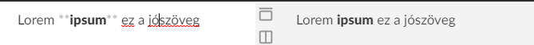

### Dőlt

A dölt formázással kiemelni kívánt szöveg köré `***`.

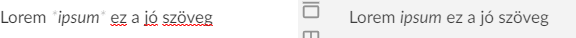

### Félkövér és Dőlt is

A félkövérrel és dőlt formázással kiemelni kívánt szöveg köré `***`.

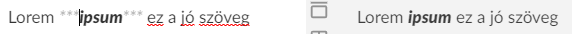

## Idézetek

Idézetek elhelyezésére a `>` segítségével van lehetőségünk, melyek egymásba ágyazhatóak.  
Több, másik markdown formázás is használható az idézetben, például a címsor, a felsorolások, illetve a kiemelések is. (Van amit nem lehet, de ezt ki kell kísérletezni használat közben)   
Itt szintén best practice, hogy a blokk előtt és után egy-egy üres sor hagyandó. 

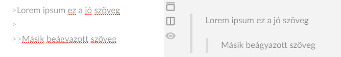

## Listák

A listák elemei közé tetszőlegesen szúrható bekezdés, idézet, kódrészletet tartalmazó mező (később részletezve), illetve kép is. Ennek előnye, hogy ezen elemek beszúrása sem akasztja meg a listák folytonosságát.

### Rendezett listák

Rendezett listát számozással `1. ` után adhatjuk meg:

- A lista elemek tetszőleges sorrendben lehetnek (itt átszámozza a végeredményben, tehát ha `1. 5. 2.` jön, abból `1. 2. 3.` elemek lesznek, az eredeti sorrendnek megfelelően, csak más számozással)
- Bármelyik számtól kezdődhet (akkor onnantól kezdve indul a számozás ` 2. 5. 3.`-ból `2. 3. 4.`).   

A lista elemei egymásba ágyazhatóak, a sor elejei tabulálás segítségével

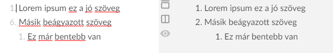

### Nem rendezett listák

Nem rendezett listát a `-`, `+`, `*` jelek bármelyikével megadhatjuk. (De azonos szinten, ne keverjük őket!)

A lista elemei egymásba ágyazhatóak, a sor elejei tabulálás segítségével

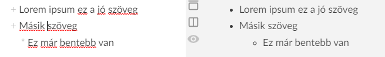

## Kódrészletek

### Pár szavas kódrészletek

Ezeket a kódrészleteket (Például egy-egy Git parancs) a `` ` `` között kell megadni
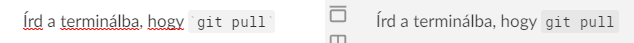

### Kódblokkok

Kódblokkokat automatikusan végrehajtja, ha a sor elején legalább 4 darab space található

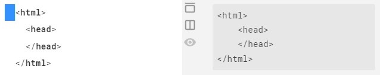

## Vízszintes elválasztó vonal

Vízszintes vonal elhelyezésére a `***` `___` `---` (mindegyik karakter háromszor) segítségével van lehetőség.  
**Vigyázz!** A `---` előtt és után is hagyj egy üres sort különben az címsorként fog megjelenni!  
Best practise tip: mindegyik vízszintes vonal előtt és után is hagyj üres sort

Ahogy a képen is látható, csak a `---`-nál kell figyelni, de jobb, ha mindegyik előtt és után is hagyunk üres sort a jobb olvashatóság miatt

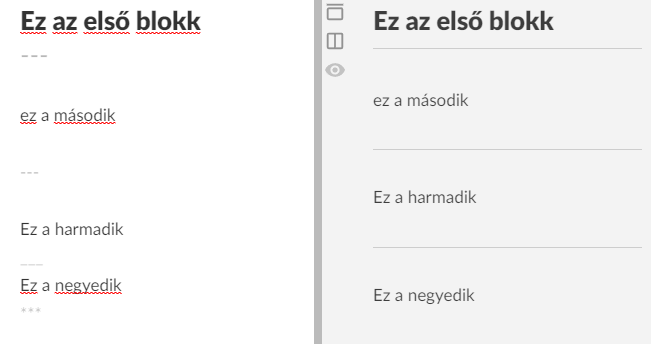

## Linkek

Linkeket markdown illetve (amennyiben támogatott) html formátumban is meglehet adni.  
Ha markdownban adjuk meg és az url tartalmaz speciális karaktert, akkor annak ASCII encode változatát kell használni (Például: space helyett %20, nyitó zárójel helyett %28, csukó zárójel helyett %29. [További encode karakterek itt](https://www.w3schools.com/tags/ref_urlencode.ASP) )

Illetve link formázására is van lehetőség ezt `[szöveg]`-előtt (kiemelések) kell elvégezni, illetve a code formázást a ``[`szöveg`]``-en belül (DE a kettő együtt nem működik

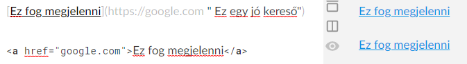

## Képek

### Képek megadása

``

### Képek megadása linkkel 

Van lehetőség a képet "kattinthatóvá tenni", azaz a képre kattintva egy másik oldalra navigálni, ezt az alábbi szintaxissal tudjuk elérni:

``

## Escape karakter

Escape karakter segítségével tudunk valamilyen, a nyelvhez szükséges karaktert megjeleníteni, hogy annak ne legyen funkcionalitása, ez a markdownban a `\`, backslash (AltGR+Q) karakter, ennek segítségével többek között meg tudjuk jeleníteni a `#` `_` `+` `-` `*` `\` `[` `]` `{` `}` `<` `>` `(` `)` `.` `!` `|` `` ` ``.

## HTML tag használata

Lehetőség van HTML tag használatára (pl `<em>szöveg</em>`, div, table, p illetve egyéb), de ez nagyon függ a markdownt használó szoftvertől is, így erről meg kell győződni.  

**Fontos:**

* Itt is tartsuk magunkat a HTML blokkok előtti és utáni egy-egy üres sortól
* Illetve amíg markdown-ban tudunk HTML-t használni, addig HTML kódrészletben (pl div) nem tudjuk a markdown által kínált formázási lehetőségeket felhasználni
