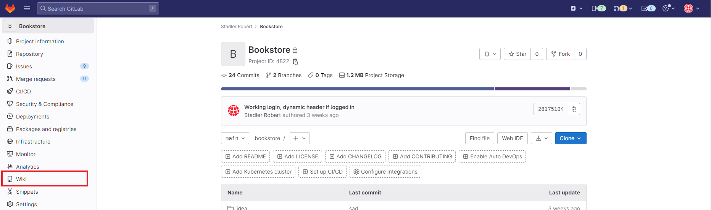
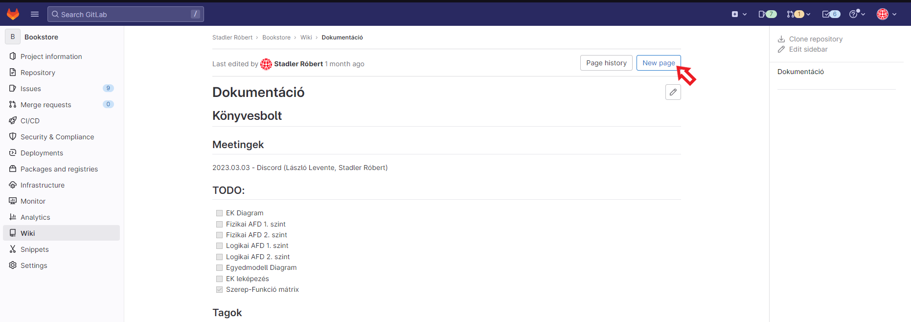
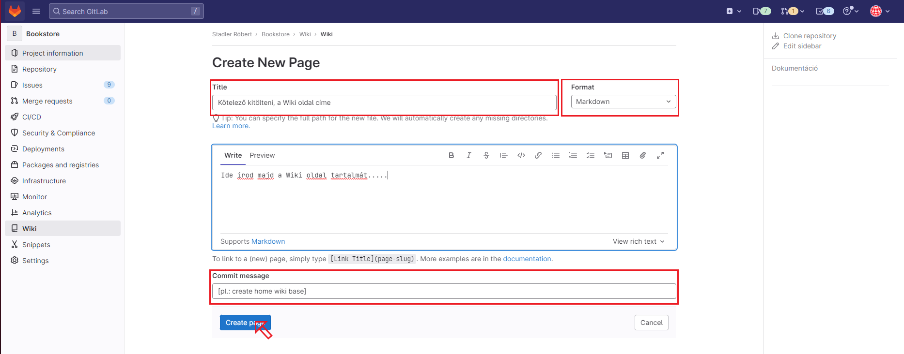

# Bevezetés a Wikibe

### Mire jó a Wiki oldal?

A Wiki oldalak segítségével különböző `Markdown` formátumú leírásokat adhatunk hozzá a projektünkhöz. 

## Miért hasznos a Wiki oldal?

A Wiki segítségével a projektmenedzsment dolgát lehet megkönnyíteni, itt el tudunk készíteni meeting memokat, fejlesztési terveket, különböző összegző dokumentumokat, illetve a tesztelés dokumentálása is történhet.

## Hogyan lehet elérni a Wiki-t a GitLab-on keresztül?

Az issue-k eléréséhez először be kell jelentkezni a GitLab-fiókba, majd válasszuk ki a megfelelő projektet. A projekt oldalán a navigációs sávban kattintsunk az `Wiki` menüpontra.

Itt megjelenik az összes Wiki oldal a projekthez kapcsolódóan.
Ahol:
- létre tudunk hozni új Wiki oldalt
- böngészni tudunk az eddig hozzáadott Wiki oldal között

# Hogyan lehet létrehozni egy Wikit-t?

A projekt oldalán válasszuk ki az `Wiki` menüpontot, amennyiben létezik a `Home` wiki, úgy a jobb felső sarokban a `New page` gombbal tudunk létrehozni.

Ha nem létezik még `Home` wiki oldal, akkor alapértelmezettként új wiki oldal létrehozásához szükséges felület tölt be.

##  Wiki tulajdonságai

A Wiki egy alapvetően `Markdown`-t támogató formátumban készülő dokumentum, de ezt szükség szerint lehet:
- RDOC
- AsciiDoc
- Org

formátum is.

##  Wiki elkészülte

Miután beállítottunk a formátumot, megadtuk neki a címet, illetve a commit üzenet részt is kitöltöttük, kattintsunk a `Create changes` gombra, hogy elmentsük, és feltöltsük a projektünkhöz az új Wiki oldalt.

## Hogyan lehet módosítani egy Wiki oldalt?

A már létező oldalon jobb felül a kis ceruza ikonra kattintva elérhetővé válik a szerkesztő (ugyanúgy néz ki, mint az új wiki szerkesztője)

##Milyen formázási lehetőségek vannak?

### Header formázás

`#` jellel történik, minél kevesebb, annál nagyobb szintű  
Helyes szintaxisa `# Szöveg` (a `#Szöveg nem konvencionális`)
Illetve a `#` tartalmazó sor előtt és után is egy üres sor hagyandó.

### Bekezdés formázása

Szimplán egy üres sor a két szöveg között (ne használjunk tabulálást a sor elején, az egy másik formázás... [később])

## Sortörés

  vagy dupla vagy annál több space a sor végén

## Kiemelések

# Félkövér

A szöveg köré `**`.

# Dőlt

# Félkövér és Dőlt is

