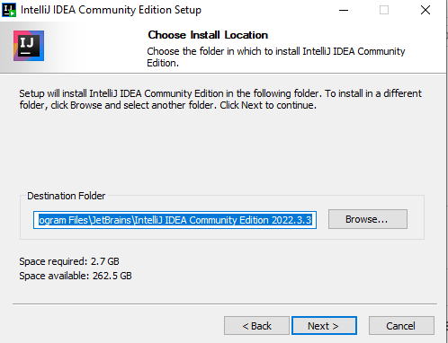
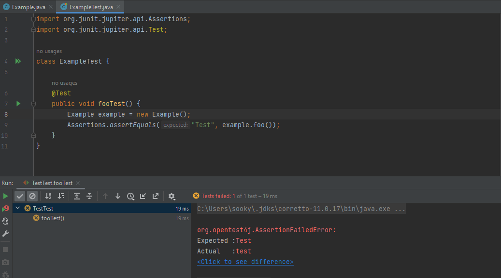

### IntelliJ IDEA IDE Community Edition Telepítése és beállítása, Hatékony használata tesztelés közben

#### Rendszerkövetelmények: 

#### Telepítés
#### Hivatalos leírás: [link](https://www.jetbrains.com/help/idea/installation-guide.html)
1. telepítő letöltése: [link](https://www.jetbrains.com/idea/download/#section=windows)
2. Először a célmappát kell kiválasztani, ahova szeretnénk installálni.                                                                               
   
3. Ezután lehetőségünk van választani, hogy bizonyos kiterjesztésű file-oknál megjelenjen megnyítási lehetőségként az IntellIj, illetve dekstop shortcut létrehozásáról is dönthetünk (érdemes bepipálni).

   
4. Ezen a ponton csak nyomjunk a Install-ra.                      
   
5. Magával a telepítéssel így meg is volnánk, jdk a közös gyakorlati kurzusfórumon megtalálható a CodeMetropolishoz.                                   
   

#### Tesztelés
#### hivatalos leírás: [link](https://www.jetbrains.com/help/idea/tests-in-ide.html)

teszt generálása: ALT + Insert az adott metódusra és a test-re kell kattintani.
   

teszt fail-nél láthatjuk a várt és a tényleges közti különbséget, így ezeket könnyedén össze tudjuk hasonlítani, illetve ezeket szintén van lehetőség debugolni.

#### Baeldung JUnit tutorial: [link](https://www.baeldung.com/junit)
#### Bealdung Mockito tutorial: [link](https://www.baeldung.com/mockito-series)