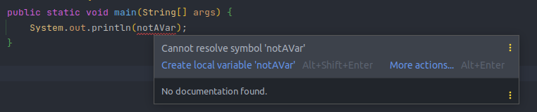
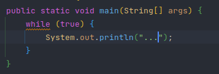
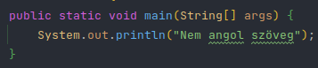

## Kód navigáció

### Keresés

Többféle tartalmat is van lehetőségünk keresni

- Szöveget
- Fájlokat
- Osztályokat
- Szimbólumokat
- Parancsokat

#### Szövegek keresése

Lokálisan: <kbd>ctrl</kbd> + <kbd>F</kbd>

Egész projektben: <kbd>ctrl</kbd> + <kbd>shift</kbd> + <kbd>F</kbd>

Szöveg keresése során van lehetőségünk teljes szavakra keresni, kis és nagy betűk között különbséget tenni, valamint reguláris kifejezéseket is használhatunk.Arra is van továbbá lehetőségünk, hogy a találatok között szabadon navigáljunk.

Amennyiben keresés során le szeretnénk cserélni a keresett szöveget valami teljesen másra, akkor az <kbd>F</kbd> gomb helyett az <kbd>R</kbd> gombot megnyomva kapunk egy plusz sort ahova begépelhetjük az új szöveg tartalmát

Ez után szabadon választhatunk hogy csak azt a szót írjuk felül amin épp állunk, vagy az összes, általunk megadott kifejezésre illeszkedő szót lecseréljük az új tartalomra.

#### Fájlok keresése

Kombináció: <kbd>ctrl</kbd> + <kbd>shift</kbd> + <kbd>N</kbd>

A kombináció lenyomása után kapunk egy felugró ablakot, amiben szövegesen lehet keresni egy fájl címére

#### Osztályok keresése

Kombináció: <kbd>ctrl</kbd> + <kbd>N</kbd>

A kombináció lenyomása után kapunk egy felugró ablakot, amiben szövegesen lehet keresni egy osztály címére

#### Szimbólumok keresése

Kombináció: <kbd>ctrl</kbd> + <kbd>alt</kbd> + <kbd>shift</kbd> + <kbd>N</kbd>

A kombináció lenyomása után kapunk egy felugró ablakot, amiben szövegesen lehet keresni egy szimbólumra. IntelliJ-ben szimbólumnak minősül minden kód elem, például függvények, osztályok, adattagok, konstansok, és még sok minden más.

#### Parancsok keresése

Kombináció: <kbd>ctrl</kbd> + <kbd>shift</kbd> + <kbd>A</kbd>

A kombináció lenyomása után kapunk egy felugró ablakot, amiben szövegesen lehet keresni intelliJ-n belül értelmezett parancsokra, mint például "Go to file" vagy "Reopen project"

### Navigáció

#### Felhasználási helyek keresése

Kombináció: <kbd>ctrl</kbd> + <kbd>Left Click</kbd>

Amennyiben csak 1 helyen van használva az adott kód elem (pl függvény), akkor egyenesen oda navigál minket. Amennyiben több helyen is használva van, akkor egy listát kapunk, ahol kiválaszthatjuk hova szeretnénk navigálni.

Hasznos lehet, ha szeretnénk megtalálni, hogy egy adott függvény hol van definiálva.

#### Tabok használata

IntelliJ-ben van lehetőség fülek használatára, melyekkel egyszerre akár több fájl is nyitva lehet párhuzamos szerkesztésre, de akár ugyanazt a fájlt többször is megnyithatjuk egymás mellé.  
Ezeket a tabokat elhelyezhetjük többféle elrendezésben is. pl.:

- Csak 1 fül látszik
- Egymás mellett több fül látszik
- Egymás alatt több fül látszik
- Egymás mellett illetve egymás alatt is több fül látszik

### Szerkesztés

#### Átnevezés

Kombináció  <kbd>shift</kbd> + <kbd>F6</kbd>

Átnevezi az összes referenciát az adott mappára, fájlra, osztályra, függvényre, konstansra vagy változóra.

#### Kiegészítés

Kombináció  <kbd>ctrl</kbd> + <kbd>space</kbd>

Az adott kontextusban elérhető és releváns összes kiegészítést felajánlja. Amennyiben egy adott osztály vagy változó nincs importálva, akkor is felajánlja az IDE, majd azt választva be is importálja.

#### Kód hibák és pontatlanságok kiemelése és javítás

Kombináció (javítás): <kbd>alt</kbd> + <kbd>enter</kbd>

##### Hiba kiemelés

Amennyiben szemmel láthatóan hibás kódot írunk (nem létező változóra próbálunk hivatkozni stb), akkor azt a fejlesztői környezet pirossal aláhúzza, valamint a legtöbb esetben fel is ajánl egy javítási lehetőséget

##### Figyelmeztetés kiemelés

Kombináció (javítás): <kbd>alt</kbd> + <kbd>enter</kbd>

Amennyiben olyan kódot írunk, amiben lehetséges hogy van hiba (végtelen ciklus stb), akkor azt a fejlesztői környezet sárgával alá húzza,  valamint a legtöbb esetben fel is ajánl egy javítási lehetőséget

##### Félreírás kiemelés

Kombináció (javítás): <kbd>alt</kbd> + <kbd>enter</kbd>

Amennyiben félreírunk egy kifejezést, akkor azt zöld színnel aláhúzza. Alap helyzetben az IDE csak az angol szótárat ismeri, szóval minden egyéb nyelven írt szót alá fog húzni. Van lehetőség extra szótárakat hozzáadni, a következőképpen: https://www.jetbrains.com/help/idea/spellchecking.html#dictionaries

## Kód futtatása

Több opciónk is van elkészült kódunk futtatására, tesztelésére

- Futtatás terminálban
- Futtatás run fülön

### Futtatás terminálban

Hasznos lehet nem különálló terminált nyitni, hanem a fejlesztői környezetbe beépítettet használni, mert így elég egy eszköz több feladat ellátására, valamint ha új terminált nyitunk meg az IDE-ben, akkor azonnal a projekt kezdőpontjáben lesz nyitva, szóval nem szükséges elnavigálnunk oda, ezzel is időt spórolva.

### Futtatás run fülön

Amennyiben szeretnénk egy adott parancsot (pl mvn compile) gyakran, akár gyorsgombbal is futtatni (<kbd>shift</kbd> + <kbd>F10</kbd>), akkor érdemes lehet futtatási környezetet létrehozni erre. Hogy ezt megtegyünk nincs más dolgunk, mint a jobb felső sarokban található "Run/Debug Configuration" fület lenyitni, majd az "Edit Configurations..." opciót kiválasztva felvehetünk újat, vagy akár szerkeszthetjük már meglévő konfigurációinkat. Futó konfigurációinkat van lehetőség megállítani, vagy akár újraindítani egyetlen gombnyomással.
