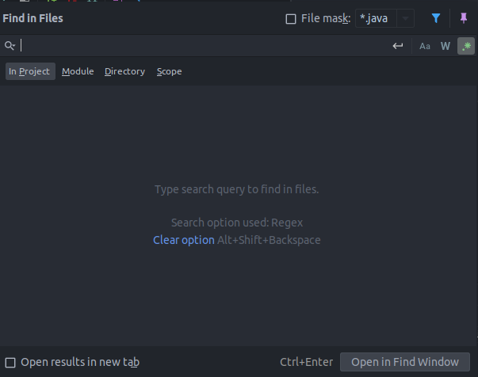
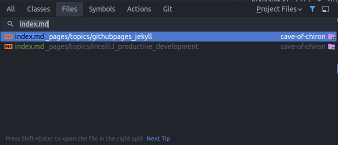
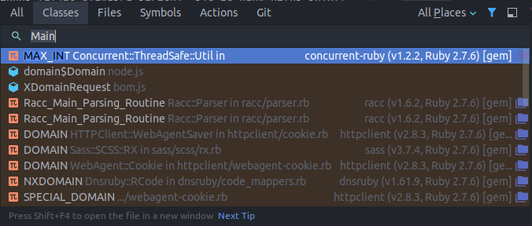
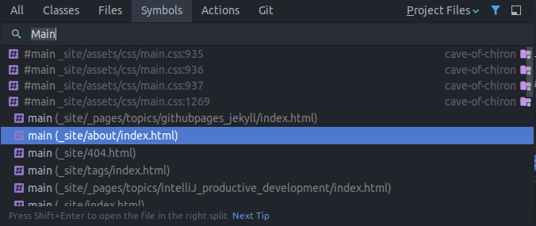
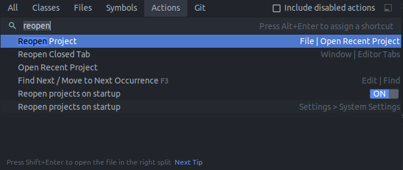

## Kód navigáció

### Keresés

Több féle tartalmat is van lehetőségünk keresni

- Szöveget
- Fájlokat
- Osztályokat
- Szimbólumokat
- Parancsokat

#### Szövegek keresése

Lokálisan: <kbd>ctrl</kbd> + <kbd>F</kbd>

Egész projektben: <kbd>ctrl</kbd> + <kbd>shift</kbd> + <kbd>F</kbd>

Szöveg keresése során van lehetőségünk teljes szavakra keresni, kis és nagy betűk között különbséget tenni, valamint reguláris kifejezéseket is használhatunk. Valamint arra is van lehetőségünk, hogy a találatok között szabadon navigáljunk.

Amennyiben keresés során leszeretnénk cserélni a keresett szöveget valami teljesen másra, akkor az <kbd>F</kbd> gomb helyet az <kbd>R</kbd> gombot megnyomva kapunk egy plusz sort ahova begépelgetjük az új szöveg tartalmát

Ez után szabadon választhatunk hogy csak azt a szót írjuk felül amin épp állunk, vagy az összes, általunk megadott kifejezésre illeszkedő szót lecseréljük az új tartalomra.

#### Fájlok keresése

Kombináció: <kbd>ctrl</kbd> + <kbd>shift</kbd> + <kbd>N</kbd>

A kombináció lenyomása után kapunk egy felugró ablakot, amiben szövegesen lehet keresni egy fájl címére

#### Osztályok keresése

Kombináció: <kbd>ctrl</kbd> + <kbd>N</kbd>

A kombináció lenyomása után kapunk egy felugró ablakot, amiben szövegesen lehet keresni egy osztály címére

#### Szimbólumok keresése

Kombináció: <kbd>ctrl</kbd> + <kbd>alt</kbd> + <kbd>shift</kbd> + <kbd>N</kbd>

A kombináció lenyomása után kapunk egy felugró ablakot, amiben szövegesen lehet keresni egy szimbólumra. IntelliJ-ben szimbólumnak minősül minden kód elem, például függvények, osztályok, adattagok, konstansok, és még sok minden más.

#### Parancsok keresése

Kombináció: <kbd>ctrl</kbd> + <kbd>shift</kbd> + <kbd>A</kbd>

A kombináció lenyomása után kapunk egy felugró ablakot, amiben szövegesen lehet keresni intelliJ-n belül értelmezett parancsokra, mint például "Go to file" vagy "Reopen project"

### Szerkesztés

#### Átnevezés

Kombináció : <kbd>shift</kbd> + <kbd>F6</kbd>
