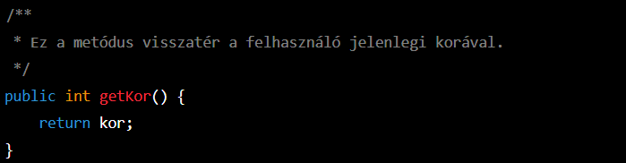
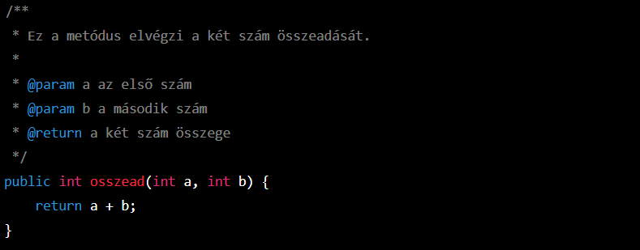
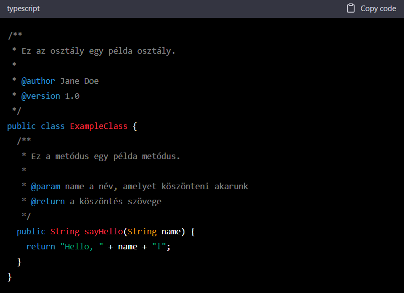
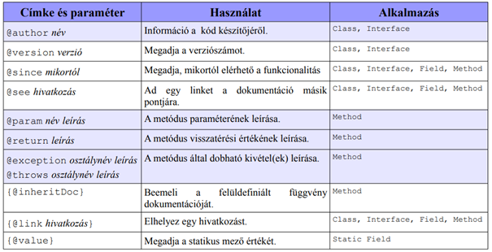
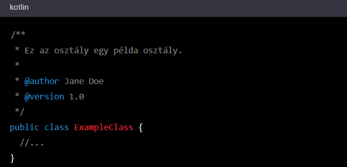
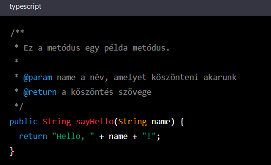

### _Javadoc_ = Forrás dokumentáció java nyelvben

Fontos, hogy programozói munkánk során figyeljünk a kód elrendezésére, felépítésére, kinézetére és átláthatóságára azért, hogy ne csak nekünk, hanem munkatársaink számára is érthető legyen.

### Mi is az a JAVADOC?

**Röviden**, a Javadoc egy egyszerű, komment alapú dokumentációs eszköz.

A Javadoc lehetővé teszi a Java programozási nyelv dokumentációjának előállítását, segítségével a fejlesztők a Java kódjukhoz speciális címkéket adhatnak hozzá, amelyek a dokumentációban információkká alakulnak.
Egyből a forrásfájlba írható a dokumentáció (közvetlenül az osztályok, interfészek, metódusok, adattagok definíciója elé), amiből a javadoc program _html_ oldalrendszert generál. Így egy nekifutással szépen kommentezett forráskódot és különálló dokumentációt kaphatunk.
A Javadoc nagyon hasznos eszköz a nagyobb projektek dokumentálásához, mivel lehetővé teszi a programozók számára, hogy könnyen áttekinthessék a kód struktúráját és funkcióit, és hogy mások is könnyen megérthessék a fejlesztett alkalmazásokat. A segítségével a kódhoz tartozó dokumentáció könnyen olvasható és érthető lesz azok számára is, akik nem fejlesztők, de a kód használói lehetnek.

### Használata

Ezek a kommentek nem állhatnak kódblokkon belül. Osztályt, mezőt, konstruktort vagy metódust kell megelőznie. Egyéb helyeken figyelmen kívül lesznek hagyva.

Lehet **egysoros** Javadoc komment

Lehet többsoros Javadoc komment

**Szabályok:**
1.)	A Java kódban meg kell jelölni a dokumentálni kívánt elemeket a Javadoc címkékkel. A Javadoc címkék az /** és */ karakterek között helyezkednek el, és @ jelölővel kezdődnek.

2.)	A Javadoc parancssoros eszközét kell használni a dokumentációs fájl előállításához. A parancssori argumentumok között meg kell adni a dokumentálni kívánt Java fájlokat, majd a Javadoc létrehozza a dokumentációs fájlokat.
pl.: javadoc ExampleClass.java

### Dokumentációs címkék/tagek

A kommentek tartalmazhatnak általános leírást és Javadoc block tageket. A block tagek @[tag neve] ([paraméter]) [leírás] alakban állnak, belőlük a Javadoc-on belül a dokumentáció részletesebb részei (details részek) generálódnak ki. A kommentek általános leírásain, illetve a block tagek leírásain belül inline tageket használhatunk, amikkel például más Java osztályokra hozhatunk létre hivatkozást vagy fix széles betűtípussal szedett szöveget illeszthetünk be.

### Példák
Az alábbi példákon bemutatom, hogyan használhatók a Javadoc címkék a Java kód dokumentálásához.
Az **osztály** dokumentálása:

A **metódus** dokumentálása:

Az **adattag** dokumentálása:

### Kapcsolódó hivatkozások
https://www.youtube.com/watch?v=-oZNKjVPCz4
https://honvedp.wordpress.com/2019/05/30/forras-dokumentacio-javadoc/
https://www.ibm.com/docs/hu/radfws/9.6?topic=SSRTLW_9.6.0/org.eclipse.jdt.doc.user/reference/ref-export-javadoc.html
https://arato.inf.unideb.hu/jeszenszky.peter/download/swe/presentations/hu/javadoc.pdf
https://people.inf.elte.hu/kisuf/gyakorlatok/anyag/Java_alkalmazasok_gy_5_v2.pdf
https://pitta.web.elte.hu/java_5_3.html
