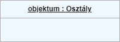
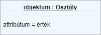
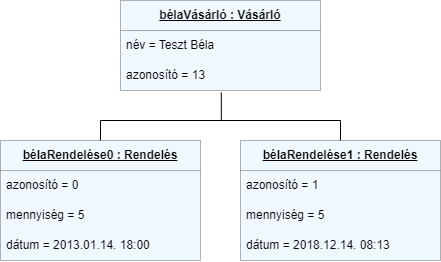

Az objektum diagram célja, hogy egy teljes vagy részleges képet mutasson a modellezett rendszer felépítéséről. Az osztályok példányait és az azok közötti kapcsolatokat ábrázolja egy adott időpontban.
## Szimbólunk és jelölések
---
### Objektum neve
Meg kell adni a példány nevét a kettőspont után pedig az osztálya nevét.  
 

### Objektum attribútumai
Egymás alatt lehet felsorolni az objektum attribútumait értékkel ellátva(!). 
 

### Kapcsolatok
Az objektumok közötti kapcsolatot nyílakkal jelöljük. Az első a leggyakrabban használt, az asszociáció, az azt követőek rendre öröklődés, aggregáció, kompozíció. 
 

## Példa
---
Az alábbi példa egy rendelés menedzselő rendszer egy részletét modellezi, ahol vásárlóBéla a Vásárló osztály egy példánya, akinek eddig két rendelése érkezett be, mindkét rendelése egy-egy példánya a Rendelés osztálynak. A vásárló és a rendelései közötti kapcsolat asszociatív.
  

## Hasznos linkek
---
További példákat [ezen](https://www.visual-paradigm.com/guide/uml-unified-modeling-language/what-is-object-diagram/) a linken, illetve segítséget a kapcsolatok megállapításához pedig [itt](https://www.visual-paradigm.com/guide/uml-unified-modeling-language/what-is-object-diagram/) találtok.