Az [Ubuntu](https://ubuntu.com/) egy Debian-on alapuló GNU/Linux disztribúció, amely alapértelmezetten a GNOME grafikus felhasználói felületet használja. A jelenlegi LTS verzió 22.04-es verziószámú és a Jammy Jellyfish kódnévre hallgat.

# Telepítés hardware-en

## Előfeltételek
    - PC vagy laptop legalább 25GB tárhellyel
    - Pendrive (legalább 8GB tárhellyel)
    - Internetkapcsolat (ajánlott)

## Ubuntu beszerzése

Mint a legtöbb GNU/Linux disztribúció az Ubuntu is ingyenesen beszserezhető operációs rendszer, a [hivatalos oldalról](https://ubuntu.com/) tudjuk beszerezni.

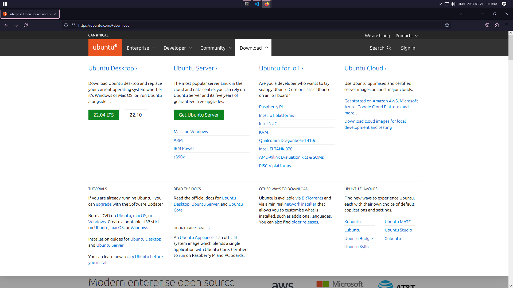

## Telepítő médium elkészítése

Ahhoz hogy telepíteni tudjuk a számítógépünkre az új operációs rendszerünket szükségünk van egy boot-olható pendrive elkészítésére. Több szoftverrel van lehetőségünk egy ilyen telepítési médiumot készíteni a példa kedvéért a [balenaEtcher-t](https://www.balena.io/etcher) fogjuk használni, ami elérhető Windows, Mac és Linux eszközökre is. Miután letöltöttük és telepítettük a következő felület fogad minket:

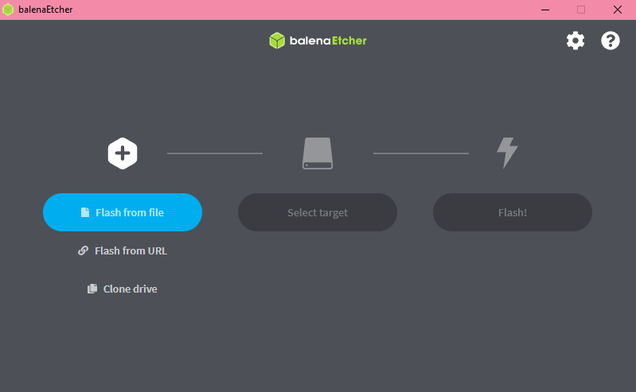

Első lépésben válasszuk ki az előző lépésben letöltött ISO fájlt, majd a használni kívánt pendrive-ot, kattintsunk a `Flash!` gombra, majd várjunk, hogy elkészüljön a boot-olható pendrive.

## Boot-olás pendrive-ról

Az előző lépésbel elkészített pendrive-ot helyeztük be a számítógépünkbe, majd indítsuk újra. Lépjünk be a `BIOS` beállításokba, (mielőtt boot-olna az operációs rendszerünk nyomjuk le a `DEL` vagy az `F2` billentyűt) és helyezzük a boot sorrend első helyére a telepítőt tartalmazó pendrive-unkat. Mentsük el a módosításainkat, lépjünk ki a `BIOS`-ból majd várjuk meg amíg boot-ol a telepítőnk.

## Telepítés menete

### Live enviroment

Boot-olás után lehetőségünk van a telepítendő operációs rendszerünket kipróbálni a telepítés előtt az úgy nevezett "live enviroment-be". Egy ablak fog fogadni minket, ahol választhatunk, hogy csak kipróbálni, vagy telepíteni szeretnénk az Ubuntu-t. Ezt az ablakot egyelőre hagyjuk megnyitva. A telepítés előtt érdemes kipróbálni, hogy minden hardware-ünk megfelelően működik, nézzük meg, hogy van-e hangunk, működik-e a WIFI, bloetooth. Ezt a következő helyen tudjuk megtenni:

Ha esetleg bármely, az előbb felsorolt eszközünk nem működik, kérjük a mentor segítségét.

### Telepítés

Miután ezzel végeztünk kattintsunk az `Install Ubuntu` gombra, és kezdjük meg a telepítést!

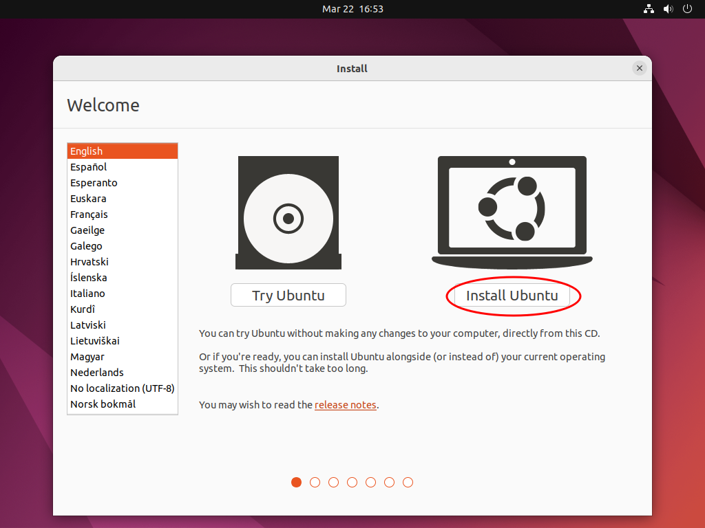

Első lépésben válasszuk ki a számunkra megfelelő billentyűzet kiosztást:

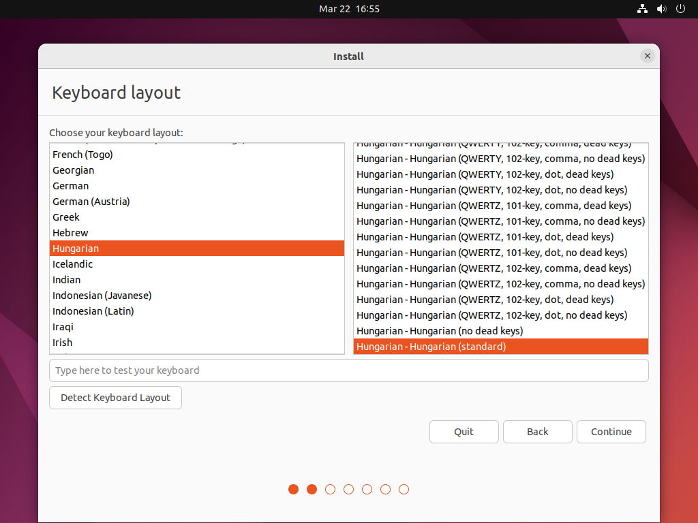

Ezután válassuk ki a számunkra megfelelő telepítési beállításokat:

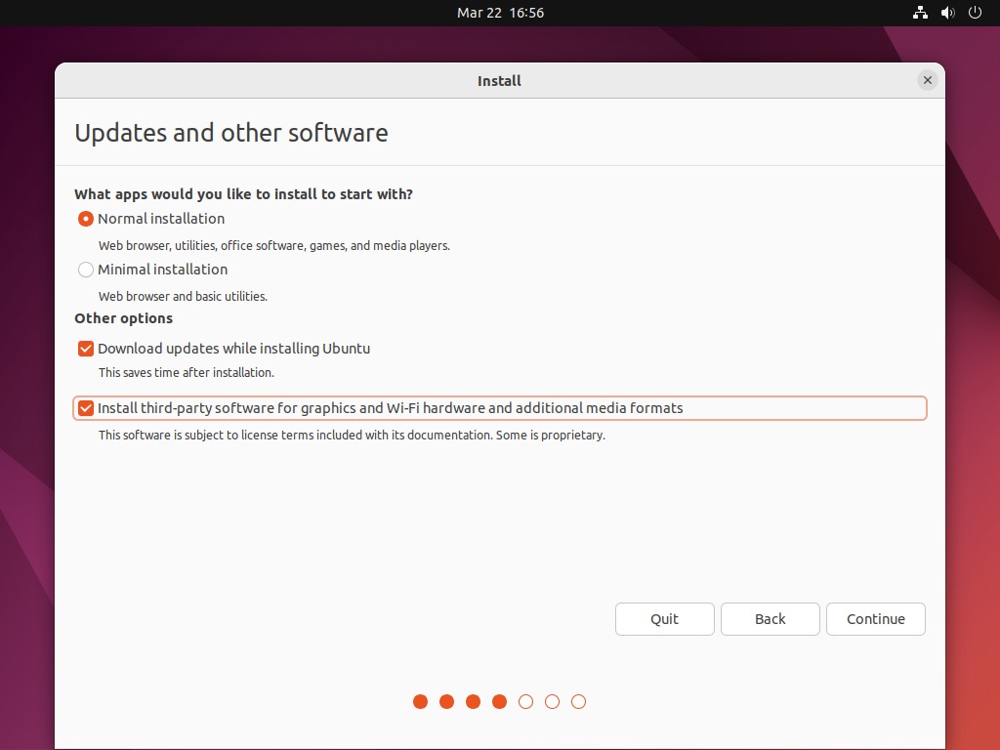

Itt lehetőségünk van választani a minimális illetve a standard  telepítés között, ez csak a telepítendő programokat határozza meg, mint például irodai programcsomag, multimédialejátszók. Továbbá lehetőségünk van kiválasztani, hogy szeretnénk-e a telepítés közben frissítéseket letölteni, valamint egyéb third-party szoftvereket letölteni, utóbbi lehetőség kiválasztása ajánlott, ha számítógépünkben `Nvidia` típusú videókártya van. Illetve ha az előző lépésben taglalt harware problémák lépnek fel, ez az opció megoldhatja azokat.

Következő lépésben válasszuk ki a számunkra megfelelő partíciós sémát:

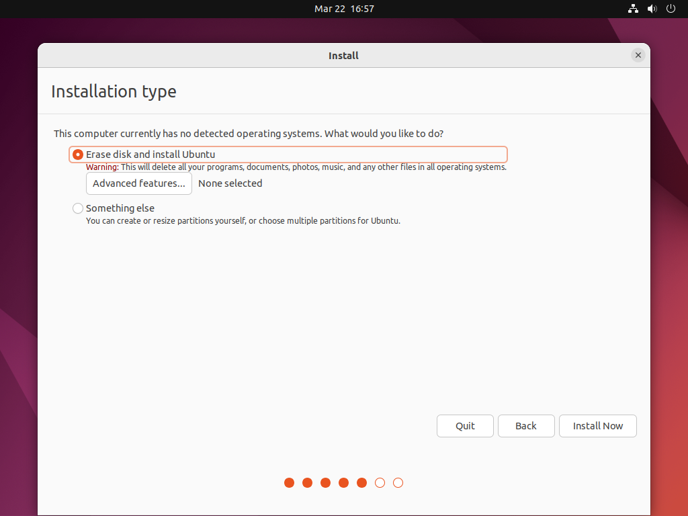

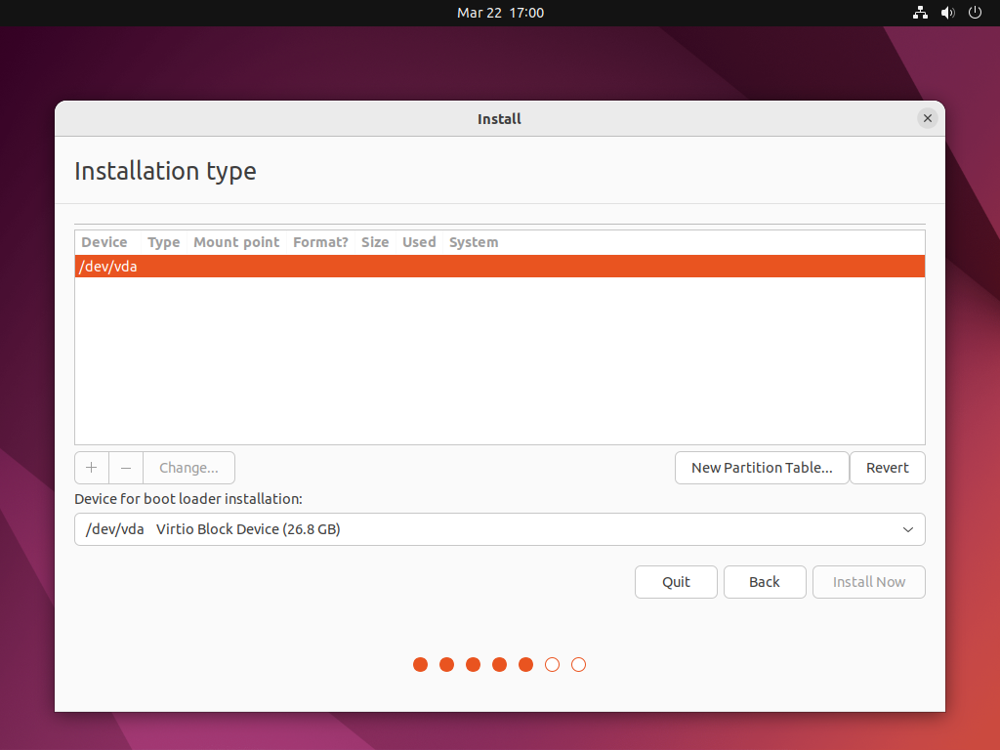

Válasszuk ki azt az időzónát amelyhez tartozunk: 

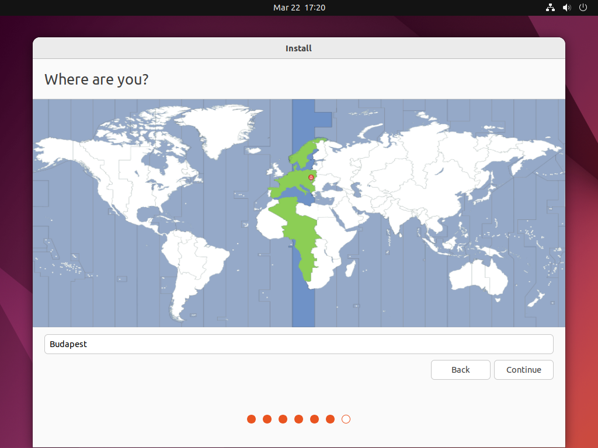

Majd hozzuk létre a felhasználónkat:

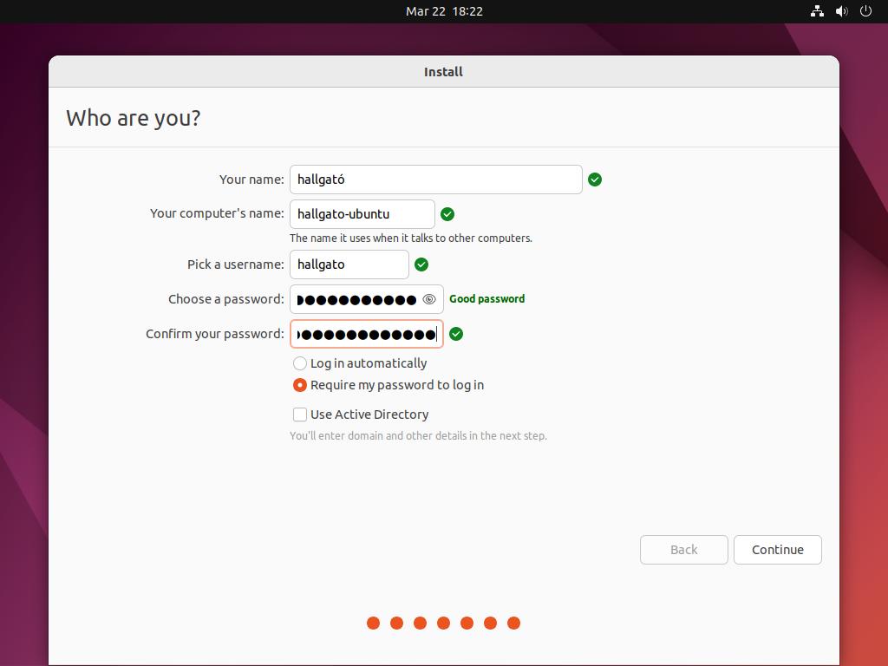

Ezután a telepítési folyamat befelyezése után indítsuk újra a számítógépünket, távolítsuk el a pendrive-ot amin a telepítő található és máris használhatjuk az új Ubuntu rendszerünket!

A [telepítési útmutató](https://ubuntu.com/tutorials/install-ubuntu-desktop#1-overview) elérhető az Ubuntu hivatalos oldalán is.

# Telepítés virtuális gépre

Virtuális gépre való telepítés csupán annyiban különbözik, hogy a letöltött ISO fájlt "behelyezzük" a létrehozott virtuális gépünkbe, majd a követjük a fent leírt lépéseket.

# Beállítás

## Szoftverek és rendszer frissítése

Az első indítás után, illetve legalább heti rendszerességgel javasolt az új rendszerünk frissítése, ezt megtehetjük a `Terminal`-ból, valamint a `Software Updater` applikációból.
Mindkét programot az úgynevezett `Activities` menüből tudjuk elérni amit a bal alsó sarokban lévő ikonra kattintva tudunk megnyitni:

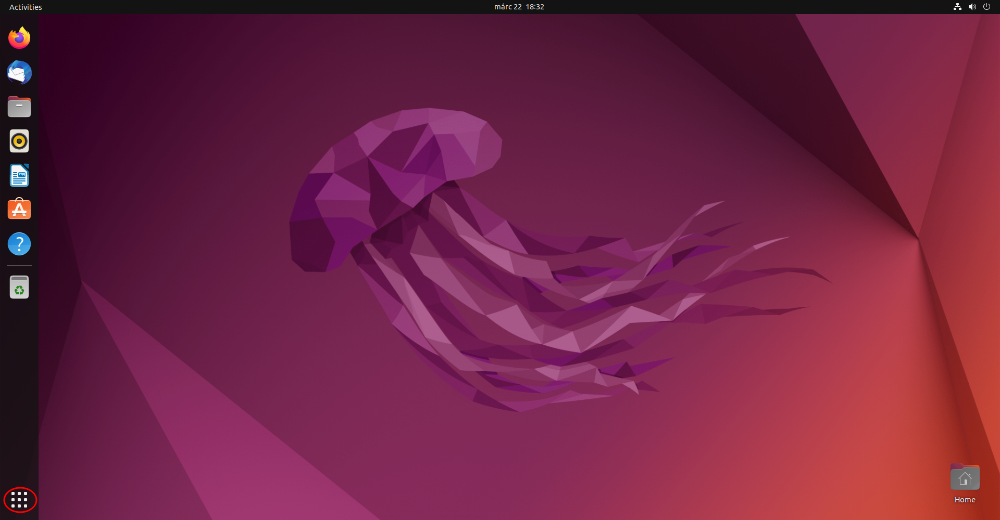

Ezután a kereső mezőbe írjuk be vagy a keresni kívánt applikáció nevét, majd indítsuk el:

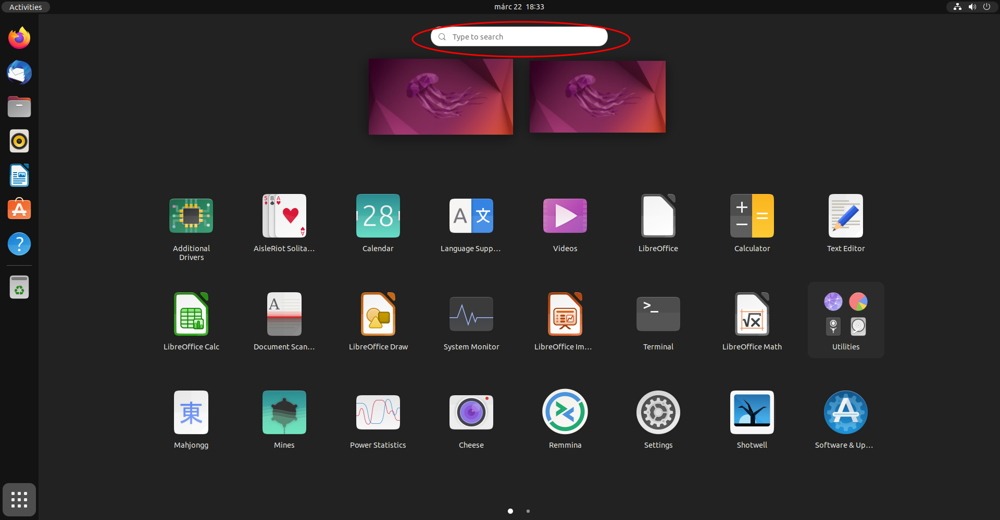

A `Software Updater` elvégzi a szükséges műveleteket számunkra automatikusan.

Terminálból való frissítéshez a következő parancsokat kell beírnunk: `sudo apt update`, a frissítések kereséséhez, majd ezt követően `sudo apt upgrade` paranccsal telepíthetjük a frissítendő csomagokat.

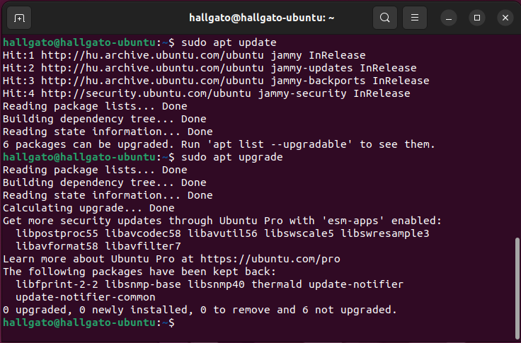

## Szoftverek beszerzése