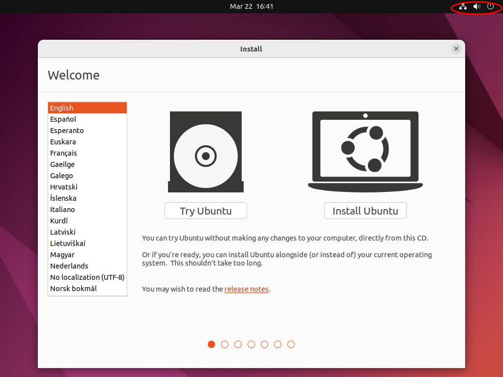

Az [Ubuntu](https://ubuntu.com/) egy Debian-on alapuló GNU/Linux disztribúció, amely alapértelmezetten a GNOME grafikus felhasználói felületet használja. A jelenlegi LTS verzió 22.04-es verziószámú és a Jammy Jellyfish kódnévre hallgat.

# Telepítés hardware-en

## Előfeltételek
    - PC vagy laptop legalább 25GB tárhellyel
    - Pendrive (legalább 8GB tárhellyel)
    - Internetkapcsolat (ajánlott)

## Ubuntu beszerzése

Mint a legtöbb GNU/Linux disztribúció az Ubuntu is ingyenesen beszserezhető operációs rendszer, a [hivatalos oldalról](https://ubuntu.com/) tudjuk beszerezni.


## Telepítő médium elkészítése

Ahhoz hogy telepíteni tudjuk a számítógépünkre az új operációs rendszerünket szükségünk van egy boot-olható pendrive elkészítésére. Több szoftverrel van lehetőségünk egy ilyen telepítési médiumot készíteni a példa kedvéért a [balenaEtcher-t](https://www.balena.io/etcher) fogjuk használni, ami elérhető Windows, Mac és Linux eszközökre is. Miután letöltöttük és telepítettük a következő felület fogad minket:


Első lépésben válasszuk ki az előző lépésben letöltött ISO fájlt, majd a használni kívánt pendrive-ot, kattintsunk a `Flash!` gombra, majd várjunk, hogy elkészüljön a boot-olható pendrive.

## Boot-olás pendrive-ról

Az előző lépésbel elkészített pendrive-ot helyeztük be a számítógépünkbe, majd indítsuk újra. Lépjünk be a `BIOS` beállításokba, (mielőtt boot-olna az operációs rendszerünk nyomjuk le a `DEL` vagy az `F2` billentyűt) és helyezzük a boot sorrend első helyére a telepítőt tartalmazó pendrive-unkat. Mentsük el a módosításainkat, lépjünk ki a `BIOS`-ból majd várjuk meg amíg boot-ol a telepítőnk.

## Telepítés menete

### Live enviroment

Boot-olás után lehetőségünk van a telepítendő operációs rendszerünket kipróbálni a telepítés előtt az úgy nevezett "live enviroment-be". Egy ablak fog fogadni minket, ahol választhatunk, hogy csak kipróbálni, vagy telepíteni szeretnénk az Ubuntu-t. Ezt az ablakot egyelőre hagyjuk megnyitva. A telepítés előtt érdemes kipróbálni, hogy minden hardware-ünk megfelelően működik, nézzük meg, hogy van-e hangunk, működik-e a WIFI, bloetooth. Ezt a következő helyen tudjuk megtenni:



Ha esetleg bármely, az előbb felsorolt eszközünk nem működik, kérjük a mentor segítségét.

### Telepítés

Miután ezzel végeztünk kattintsunk az `Install Ubuntu` gombra, és kezdjük meg a telepítést!


Első lépésben válasszuk ki a számunkra megfelelő billentyűzet kiosztást:


Ezután válassuk ki a számunkra megfelelő telepítési beállításokat:


Itt lehetőségünk van választani a minimális illetve a standard  telepítés között, ez csak a telepítendő programokat határozza meg, mint például irodai programcsomag, multimédialejátszók. Továbbá lehetőségünk van kiválasztani, hogy szeretnénk-e a telepítés közben frissítéseket letölteni, valamint egyéb third-party szoftvereket letölteni, utóbbi lehetőség kiválasztása ajánlott, ha számítógépünkben `Nvidia` típusú videókártya van. Illetve ha az előző lépésben taglalt harware problémák lépnek fel, ez az opció megoldhatja azokat.

Következő lépésben válasszuk ki a számunkra megfelelő partíciós sémát:


Válasszuk ki azt az időzónát amelyhez tartozunk: 


Majd hozzuk létre a felhasználónkat:


Ezután a telepítési folyamat befelyezése után indítsuk újra a számítógépünket, távolítsuk el a pendrive-ot amin a telepítő található és máris használhatjuk az új Ubuntu rendszerünket!

A [telepítési útmutató](https://ubuntu.com/tutorials/install-ubuntu-desktop#1-overview) elérhető az Ubuntu hivatalos oldalán is.

## Telepítés virtuális gépre

Virtuális gépre való telepítés csupán annyiban különbözik, hogy a letöltött ISO fájlt "behelyezzük" a létrehozott virtuális gépünkbe, majd a követjük a fent leírt lépéseket.

# Beállítás

## Szoftverek és rendszer frissítése

Az első indítás után, illetve legalább heti rendszerességgel javasolt az új rendszerünk frissítése, ezt megtehetjük a `Terminal`-ból, valamint a `Software Updater` applikációból.
Mindkét programot az úgynevezett `Activities` menüből tudjuk elérni amit a bal alsó sarokban lévő ikonra kattintva tudunk megnyitni:


Ezután a kereső mezőbe írjuk be vagy a keresni kívánt applikáció nevét, majd indítsuk el:


A `Software Updater` elvégzi a szükséges műveleteket számunkra automatikusan.

Terminálból való frissítéshez a következő parancsokat kell beírnunk: `sudo apt update`, a frissítések kereséséhez, majd ezt követően `sudo apt upgrade` paranccsal telepíthetjük a frissítendő csomagokat.


## Szoftverek beszerzése

A szoftverek beszerzéséhez használhatjuk az Ubuntu saját szoftverközpontját, az `Ubuntu Software` applikációt. Ezt az applikációt szintén az Activities menüből érhetjük el.


Az `Ubuntu Software` alkalmazásban több ezer szoftver érhető el, amelyek könnyedén telepíthetők és eltávolíthatók az alkalmazás segítségével.

Ha egy konkrét szoftvert keresünk, a keresőmezőbe beírhatjuk a szoftver nevét vagy kategóriáját, majd a találatok közül kiválaszthatjuk a számunkra megfelelőt.


Ha megtaláltuk a kívánt szoftvert, kattintsunk a telepítés gombra, majd kövessük az utasításokat.


Ha egy szoftvert nem találunk az Ubuntu Software-ben, akkor az `apt` csomagkezelőt használhatjuk a terminálból való telepítéshez. Az `apt` lehetővé teszi számunkra, hogy az Ubuntu csomagjai közül telepítsünk bármely szoftvert.

Egy szoftver telepítéséhez először frissítenünk kell a csomaglistát a következő paranccsal:

```properties
sudo apt update
```

Ezután kereshetünk a szoftverek között a következő paranccsal:

```properties
apt search <keresett_szoftver>
```

Ha megtaláltuk a keresett szoftvert, akkor telepíthetjük a következő paranccsal:

```properties
sudo apt install <szoftver_neve>
```

Az alábbi példa bemutatja, hogyan telepítsük a `gedit` szövegszerkesztőt a terminálból:

```properties
sudo apt update
sudo apt install gedit
```

Ha szeretnénk eltávolítani egy telepített szoftvert, akkor a következő parancsot kell futtatnunk:

```properties
sudo apt remove <szoftver_neve>
```

Az alábbi példa bemutatja, hogyan távolítsuk el a `gedit` szövegszerkesztőt a terminálból:

```properties
sudo apt remove gedit
```

Ezekkel a parancsokkal egyszerűen telepíthetünk és eltávolíthatunk szoftvereket az Ubuntu rendszerünkön.

## Jogosultságok

Az Ubuntu biztonsági okokból számos feladat elvégzéséhez adminisztrátori jogosultság szükséges. Az adminisztrátori jogosultságokkal rendelkező felhasználók a `sudo` parancs segítségével végezhetik ezeket a feladatokat.

Az alábbi példa bemutatja, hogyan lehet adni egy felhasználónak adminisztrátori jogosultságot:

1. Nyissuk meg a Terminal-t.

2. Írjuk be a következő parancsot, és üssük le az Enter billentyűt:

```properties
sudo adduser felhasznalonev sudo
```

1. Az Ubuntu megkéri a jelszót, írjuk be, majd üssük le az Enter billentyűt.

2. Az Ubuntu megkéri az új jelszót a felhasználói fiókhoz, írjuk be, majd üssük le az Enter billentyűt.

Ezután a felhasználónak adminisztrátori jogosultsága lesz, és használhatja a sudo parancsot.

Fontos megjegyezni, hogy a `sudo` parancs használatakor nagyon óvatosnak kell lenni, mert a rossz parancsok végrehajtása károsíthatja a rendszert. Az adminisztrátori jogosultságokkal rendelkező felhasználóknak mindig figyelmesnek kell lenniük, és csak olyan parancsokat kell végrehajtaniuk, amelyeket biztonságosnak és szükségesnek tartanak.

## Alapértelmezett alkalmazások beállítása

Az Ubuntu alapértelmezett alkalmazásait lehetőségünk van saját preferenciáink szerint módosítani. Ehhez a `Settings` (Beállítások) alkalmazásban kell navigálnunk az `Details` (Részletek) menüpontra, majd a `Default Applications` (Alapértelmezett alkalmazások) részre. Itt lehetőségünk van megváltoztatni például az alapértelmezett webböngészőt, levelezőprogramot, képnézegetőt és sok más alkalmazást.


## Megosztás beállítása

Az Ubuntu lehetővé teszi számunkra, hogy egyszerűen megosszunk fájlokat és mappákat a hálózaton keresztül. Ehhez a `Settings` (Beállítások) alkalmazásban a `Sharing` (Megosztás) menüpontra kell navigálnunk. Itt engedélyezhetjük a fájlmegosztást, megadhatjuk a megosztás nevét, a megosztott mappa elérési útját és a megosztási engedélyeket.


## Sötét mód beállítása

Az Ubuntu lehetővé teszi a felhasználók számára, hogy sötét módba állítsák az operációs rendszerüket. Ennek az előnye, hogy csökkenti a kék fény kibocsátását, ami káros hatással lehet az alvás minőségére. A sötét mód beállításához a Settings (Beállítások) alkalmazásban navigáljunk az `Appearance` (Megjelenés) menüpontra, majd válasszuk ki a `Dark` (Sötét) opciót a `Theme` (Téma) résznél.


## Időzóna beállítása

Az időzóna beállítása fontos, mert így biztosítjuk, hogy a rendszer megfelelő időpontokat jelezzen nekünk. Az időzóna beállítását a következő lépésekkel tehetjük meg:

1. Kattintsunk a jobb felső sarokban található időre és dátumra.

2. Válasszuk ki a `Date & Time Settings` (Dátum és idő beállítások) lehetőséget.


3. Ellenőrizzük, hogy a `Automatic Time Zone`(Automatikus időzóna) be van-e kapcsolva, és ha igen, akkor a rendszer már beállította az időzónát helyesen.

4. Ha nem kapcsoljuk be az automatikus időzónát, akkor kattintsunk a `Time Zone` (Időzóna) fülre, majd válasszuk ki a megfelelő időzónát.

## Nyelv beállítása

Az Ubuntu alapértelmezés szerint angol nyelvű, de természetesen támogatja a többi nyelvet is. A nyelv beállítását a következő lépésekkel tehetjük meg:

1. Menjünk be `Settings` (Beállítások) alkalmazásban és válasszuk ki a `Region & Language` (Nyelvtámogatás) lehetőséget.


2. A megjelenő ablakban kiválaszthatjuk az alapértelmezett nyelvet a "Language" menüpont alatt.
    
3. A "Formats" menüpontban módosíthatjuk a dátum, idő, valuta és mértékegység beállításokat az aktuális régióhoz igazítva.
    
4. A "Input Sources" menüpontban hozzáadhatjuk a használni kívánt billentyűzeteket, valamint azokat is eltávolíthatjuk, amelyeket nem használunk.
    
5. Ha több nyelvet szeretnénk használni, a "Manage Installed Languages" opció segítségével telepíthetjük a szükséges nyelvi csomagokat.

Ezek után az új beállításokat azonnal alkalmazni fogja a rendszer. A nyelvi beállításokat a "Region & Language" opcióban bármikor módosíthatjuk.

## Egér és érintőpad beállítások

Az egér és az érintőpad beállításait a `Settings` (Beállítások) alkalmazásban találjuk meg, és menüben `Mouse & Touchpad` (egér és érintőpad) néven.  Itt változtathatjuk meg az egér sebességét, a görgők viselkedését és az egérgombok funkcióit is.


## Háttérkép beállítás

Az Ubuntu Unity asztali környezete lehetővé teszi, hogy testre szabjuk a háttérképet. Ehhez kattintsunk jobb egérgombbal az asztalon, majd válasszuk ki a `Change Desktop Background` (Háttérkép módosítása) opciót.

Ezután erre visz minket:


Itt kiválaszthatjuk az alapértelmezett háttérképeket, vagy saját képet is beállíthatunk.

## Alap rendszerinformációk 

Az `About` opció általában a `Settings` (Beállítások) alkalmazás almenüjében található. Az Ubuntu esetében az `About` opció a `Details` (Részletek) menüpont alatt érhető el. A `Settings` alkalmazás megnyitásához kattintsunk az `Activities` (Aktivitások) gombra a bal oldali alsó sarokban, majd írjuk be a keresőmezőbe a `Settings` szót. Amikor az `Settings` alkalmazás megjelenik, kattintsunk a `Details` menüpontra, ahol megtaláljuk a rendszer információit, például a rendszer verzióját, a processzor adatait, a memóriát és a grafikus kártyát.


