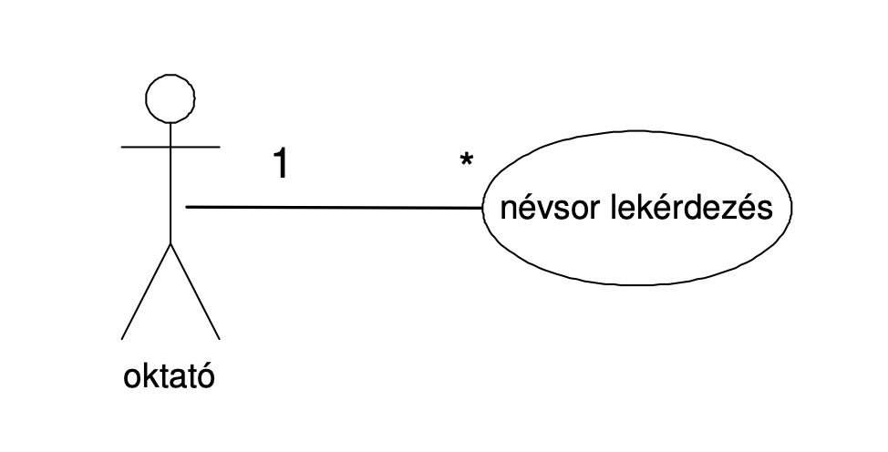
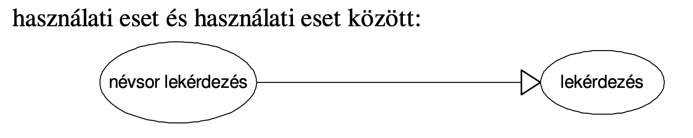
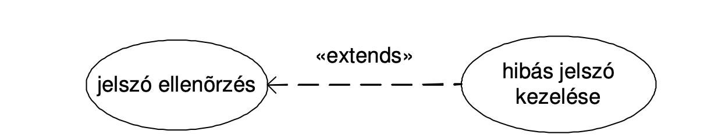
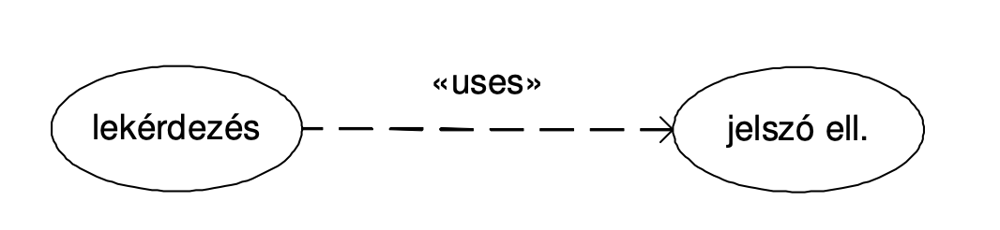
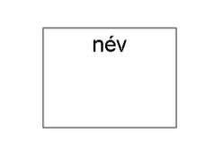
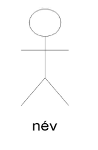
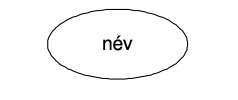
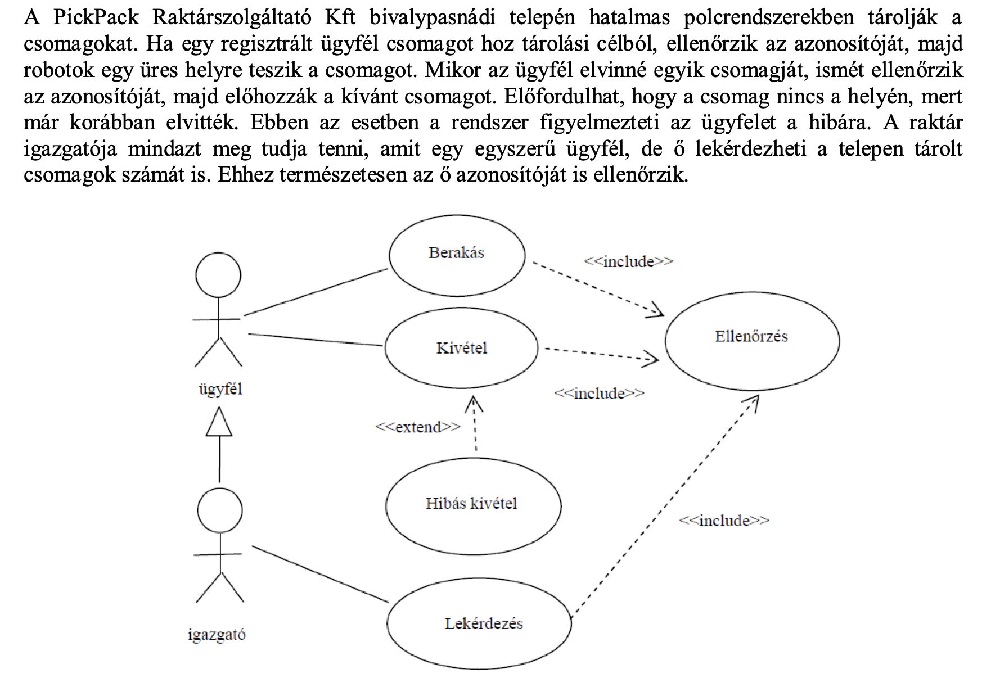
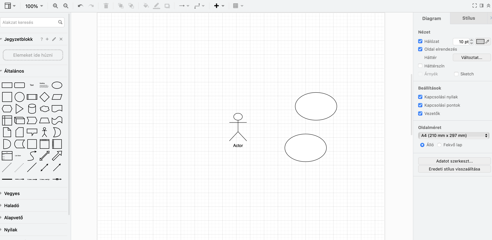

# UML-Használati eset diagram használata

Az **UML**, azaz az **Unified Modeling Language** (egységes modellező nyelv) egy standard nyelv, amelyet szoftvertervezéshez használnak. Az UML diagramok segítségével a rendszer tervezése és dokumentálása történik. Az UML diagramok sokféle típusa létezik, és mindegyikük egy adott szempontból ábrázolja a rendszert.
Az egyik típu

Az UML 13 különböző diagramtípusból épül fel. A 2.0 és magasabb verziók a diagramokat két fő csoportba sorolják.

**-Strukturális diagramok** (structural modeling diagrams): a modell statikus architektúrájának definiálására alkalmasak. Azokat az elemeket (és egymás közötti kapcsolatait és függőségeiket) modellezhetjük segítségükkel, amelyekből a rendszer felépül: osztályok, objektumok, interfészek, fizikai komponensek.

**-Viselkedés diagramok** (behavioral modeling diagrams): a modell dinamikus aspektusainak modellezésére használatosak. A modell statikus elemeinek együttműködését, az egyes elemek viselkedését írhatjuk le segítségükkel. Mindig van idő dimenziójuk.
## Használati eset diagram

A használati eset diagram a rendszer viselkedését modellezi funkcionalitás szempontjából. A legmagasabb absztrakciót valósítja. A rendszert a felhasználó, megrendelő szemszögéből modellezi. Összességében megvilágítja a rendszer tervezett funkcióit, a rendszer környezetét és ezek kapcsolatait.

### Asszociáció
Felhasználó és használati eset közötti kommunikáció, általában ige, folytonos vonallal jelöljük

### Általánosítás
Egyik használati eset vagy aktor általánosabb formája a másiknak, jelölése: folytonos vonal, egy üres háromszöggel az ős oldalán

### Kiterjesztés
Egyik használati eset kiterjeszti újabb funkcionalitással a másikat, az extend kulcsszót használjuk, jelölése: szaggatott vonallal a kiterjesztett használati eset irányába mutató nyíllal

### Tartalmazás
Egyik használati eset tartalmazza a másikat, az include kulcsszót használjuk, jelölése: szaggatott vonallal a tartalmazó használati eset irányba mutató nyíllal

## A diagram részei
♦ **Rendszer** (system): amit el akarunk készíteni

♦ **Aktor**(actor): egy szerepkört reprezentál. Környezet: a világ, ami a rendszert körülveszi - aktorok a felhasználók akik a rendszert használják

♦ **Használati esetek** (use case): elvárt viselkedési minták (mire képes a rendszer)

## Példa feladat megoldással:

## +
Első lépésként célszerű az aktorokat azonosítani, mert az általában könnyebb, és még bonyolult rendszerek esetén sem kell túl sok aktorral számolnunk. Az aktorok köre már a fejlesztés elején is pontosan meghatározható.

Következő lépés a használati esetek azonosítása. Egy bonyolult rendszer esetén nagyon sok használati esettel kell foglalkozni, ezért ebben is az inkrementális megközelítés javasolt.

### UML diagramok létrehozásához több alklamas eszköz elérhető
Draw.io: https://draw.io/

ArgoUML: https://argouml-tigris-org.github.io/

BOUML: http://bouml.free.fr/download.html

StarUML: https://staruml.io/

DIA: https://wiki.gnome.org/Apps/Dia

Talán a legelterjedtebb a **Draw.io** melyen számtalan más diagram is elkészíthető:
Itt kiválasztható hova szeretné menteni a későbbiekben létrehozni kívánt munkát.

Majd neki is lehet látni!:)

## Felhasznált linkek:
https://people.inf.elte.hu/molnarba/Informaciorendszerek_ELTE/Use_case/he.pdf
https://vik.wiki/images/f/f1/Szofttech_jegyzet_UML_usecasediagram_mo.pdf
https://okt.inf.szte.hu/rf1/gyakorlat/gyak5/#use-case-diagram
https://gyires.inf.unideb.hu/KMITT/c02/ch08s04.html

