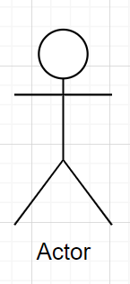
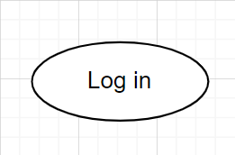
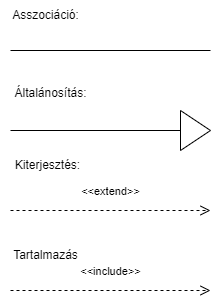
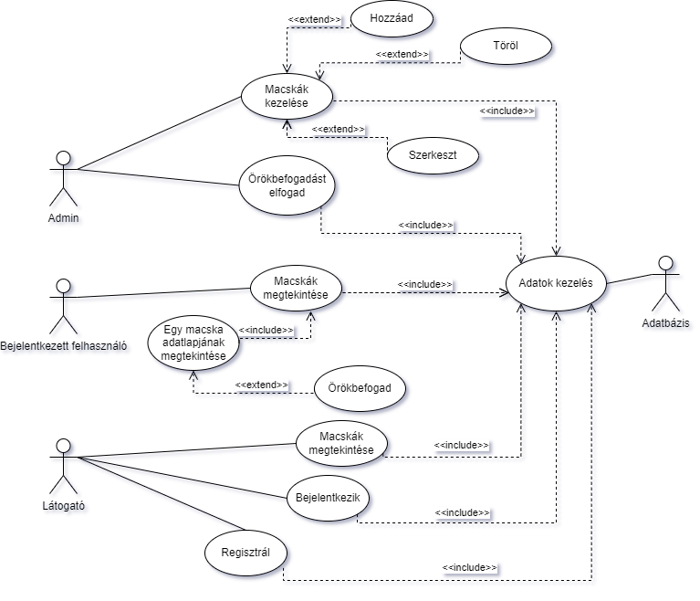
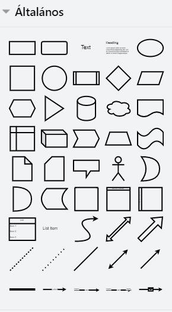

A használati eset diagram, avagy UML use case diagram egy típusa az UML diagramoknak, amely az alkalmazások funkcionális 
követelményeit és az azok közötti viszonyokat ábrázolja.
A use case diagramok bemutatják az alkalmazás használatát különböző szereplők (aktorok) és az azok közötti interakciók 
(use case-ek) segítségével. Az aktorok lehetnek valós vagy virtuális szereplők, például felhasználók, rendszerek, 
külső komponensek stb., akik kapcsolatba lépnek az alkalmazással. A use case-ek pedig a különböző felhasználói 
szcenáriókat, azaz az alkalmazás funkcióinak használatát ábrázolják. Egyik fontos követelménye, hogy a megrendelő által 
is érthető legyen, ezáltal elősegítse a rendszer fejlesztését.

## Röviden az UML-ről
Az UML (Unified Modeling Language) egy általános célú modellezési nyelv, amelyet a szoftvertervezők használnak az 
alkalmazások tervezéséhez, fejlesztéséhez és dokumentálásához. Az UML diagramok ábrákkal és szimbólumokkal ábrázolják 
az alkalmazások szerkezetét, viselkedését és funkcióit. Ezek segítségével a fejlesztők könnyen kommunikálhatnak például 
az ügyfelekkel. Az UML segítségével lehetőség van az alkalmazások tervezésének és dokumentálásának standardizálására, 
ami növeli az alkalmazások minőségét és fejlesztési folyamatának hatékonyságát.

## A diagramban jelölt kapcsolatok

### Asszociáció
Jele: folytonos vonal.  
A felhasználó és a használati eset közötti kommunikáció.
### Általánosítás
Jele: Folyotonos vonal, háromszöggel az ős felőli végén.  
Két használati eset közötti kapcsolatot jelöl, amikor az egyik a másik általánosabb formája.
### Kiterjesztés
Jele: Szagatott vonal nyíllal a végén, amely a kiterjesztett használati eset felé mutat.  
A nyílra az extend kulcsszót írjuk.  
Az egyik használati eset kibővíti a másikat, ahhoz újabb funkciókat hozzáadva.
### Tartalmazás
Jele:  Szagatott vonal nyíllal a végén, amely a tartalmazó használati eset felé mutat.  
A nyílra az include kulcsszót írjuk.  
Az egyik használati eset tartalmazza a másikat.

## A diagram részei

### Aktor (actor)
Jele: Pálcikaember, alatta a szerepkör megnevezésével  
Egy felhasználói szerepkört reprezentál.  

### Használati eset (use case)
Jele: ovális, a használati eset nevével.  
A felhasználó által végrehajtható rendszerfunkciók.

### Relációk
Az aktor és a használati esetek közötti kapcsolatot jelzik, a fent említettek alapján.  

## Példa egy kész használati diagramra:

### Use case diagram készítése

Az UML diagrammok készítéséhez praktikus a [draw.io](https://app.diagrams.net/) használata. Nem csak 
használati eset diagram készítésére, de például osztály diagram, egyed-kapcsolat diagram vagy bármilyen más fajta
diagram készítésére is használható.
Sok grafikus elemet tartalmaz, amelyek meggyorsítják a diagramok elkészítését.

### Egyéb hasznos linkek

A Rendszerfejlesztés I. tárgy gyakorlat [honlapján](https://okt.inf.szte.hu/rf1/gyakorlat/gyak5/) 
találhatók rövid összefoglalók az UML diagramokról.