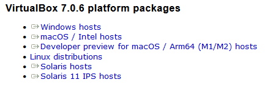

## Bevezetés

Az [Oracle VirtualBox](https://www.virtualbox.org/) egy virtualizációs termék. Segítségével virtuális számítógépeket hozhatunk létre tetszőleges (de a fizikai erőforrásainkat nem meghaladó) erőforrásokkal, majd ezen virtuális gépeken - éppúgy, mintha fizikai lenne - telepíthetünk operációs rendszereket, majd ezekre a rendszerekre felhasználói programokat. A Dockerrel ellentétben itt egy egész számítógépet virtualizálunk, nem csak a felhasználói (vagy operációs rendszer) programokat.

### Letöltés

Az Oracle VirtualBox letölthető az [eredeti oldalról](https://www.virtualbox.org/wiki/Downloads), több architektúrára és operációs rendszerre is. Példánkban Windows 10 és ArchLinux hostra is fogjuk telepíteni.

Windows 10 hosthoz válasszuk az első lehetőséget, ArchLinux esetén használjuk a csomagkezelőnket a telepítéshez (ArchLinux esetén a letöltés és a telepítés egyetlen parancsból áll).
### Telepítés

#### Telepítés Windows 10 gazdagépre

#### Telepítés ArchLinux gazdagépre
Nyissunk egy terminált, és gépeljük be az alábbi parancsot:

### Windows 10

Windows alatt a [Ruby](https://www.ruby-lang.org/en/) 2 főverziójú telepítésevel használható, bár a honlap ennél [tágabb verzió tartományt ad meg](https://jekyllrb.com/docs/#prerequisites).
Ruby-val támogatott parancssor a Start menűből indítható.

## Futtatás

### Saját gépen (Windows 10)

1. Ruby parancssor indítása.
2. Szerezzük be a projekt forráskódját (például, [Git]({{ site.baseurl }}/tags#git) verziókövetőn keresztül).
3. Navigáljunk el a Jekyll oldalunk gyökerébe, ahol a [_config.yml]({{ site.data.global_links.project.github.root }}/blob/master/_config.yml) található.
4. Szükség estén telepítsük a hiányzó függőségeket [bundler](https://jekyllrb.com/docs/ruby-101/) segítségével.
5. Indítsuk el a Jekyll fejlesztői szervert a `bundle exec jekyll serve` vagy `jekyll serve` parancssal (némelyik rendszeren csak az utóbbi működik).
6. Frissítsük az oldalt a böngészőnkben. Javasolt a `ctrl + f5` használata, hogy felülbíráljuk a böngésző gyorsítótárát és a legfrissebb változatot kérjük le a szervertől.

A fejlesztői szerver alapértelmezésként nem figyeli a config fájl változásait. Ezért ennek módosítása esetén újra kell indítani.
{: .notice--warning}

### Github Pages

A [GitHub projekt beállításainál aktiválás](https://docs.github.com/en/pages/getting-started-with-github-pages/configuring-a-publishing-source-for-your-github-pages-site) után egyéb teendőnk nincsen a várakozáson kívül. A GitHub Pages legenerálja és a megfelelő címen elérhetővé teszi az oldalunkat. A folyamat akár percekbe is telhet. Frissítsük az oldalt a böngészőnkben. Javasolt a `ctrl + f5` használata, hogy felülbíráljuk a böngésző gyorsítótárát és a legfrissebb változatot kérjük le a szervertől.