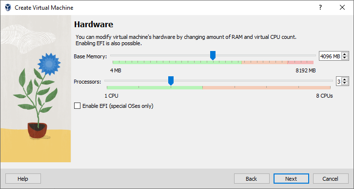

## Bevezetés

Az [Oracle VirtualBox](https://www.virtualbox.org/) egy virtualizációs termék. Segítségével virtuális számítógépeket hozhatunk létre tetszőleges (de a fizikai erőforrásainkat nem meghaladó) erőforrásokkal, majd ezen virtuális gépeken - éppúgy, mintha fizikai lenne - telepíthetünk operációs rendszereket, majd ezekre a rendszerekre felhasználói programokat. A Dockerrel ellentétben itt egy egész számítógépet virtualizálunk, nem csak a felhasználói (vagy operációs rendszer) programokat.

## Letöltés

Az Oracle VirtualBox letölthető az [eredeti oldalról](https://www.virtualbox.org/wiki/Downloads), több architektúrára és operációs rendszerre is. Példánkban Windows 10 és ArchLinux hostra is fogjuk telepíteni.

Windows 10 hosthoz válasszuk az első lehetőséget, ArchLinux esetén használjuk a csomagkezelőnket a telepítéshez (ArchLinux esetén a letöltés és a telepítés egyetlen parancsból áll).
## Telepítés

### Telepítés Windows 10 gazdagépre

1. Keressük meg a letöltési helyen a letöltött telepítő fájlt.
2. Indítsuk el a telepítőt, és engedélyezzük a futását rendszergazdaként.

3. Az üdvözlő képernyőn kattintsunk a "Next" feliratú gombra.

4. A megjelenő képernyőn láthatjuk a telepítendő komponenseket, és a telepítési helyet. A modulokon nem érdemes változtatni, a telepítési helyet mindenki saját belátása szerint egy rögzített adattároló egységre (SSD vagy HDD) telepítse.

5. A megjelenő képernyőn a telepítő figyelmeztet, hogy a virtuális hálózati eszköz telepítése miatt időlegesen lecsatlakozunk az internetről. A kérdésre, miszerint "Kívánja-e folytatni?" igennel (Yes) válaszolunk.

6. A képernyőn megjelenik egy utolsó lehetőség visszafordulni, és változtatásokat tenni (Back), vagy a telepítést megszakítani (Cancel). Mivel mi az előbbi lehetőségeink közül egyiket sem szeretnénk (tehát telepítésre készen állunk), az "Install" feliratú gombra kattintva jóváhagyjuk a telepítést.

7. A telepítést a folyamatjelzőn és a folyamatjelző fölötti információs sorban nyomonkövethetjük.
8. A következő ablakban értesít a telepítő a sikeres (vagy sikertelen) telepítésről. Sikeres telepítés esetén a pipa kivétele nélkül kattintsunk a "Finish" feliratú gombra, amely ezen telepítőt bezárja, és az Oracle VirtualBox kezelőfelületét megnyitja.

Ha a jelölőnégyzet hamis értékre van állítva (nincs bejelölve pipával), a kezelőfelület nem fog elindulni a telepítő bezárását követően, hanem manuálisan (Start menüből, vagy asztali parancsikonnal) kell elindítanunk.
{: .notice--primary}

### Telepítés ArchLinux gazdagépre
1. Nyissunk egy terminált!
2. Root felhasználóként lépjünk be a linuxos gépünkbe.
3. Gépeljük be az alábbi parancsot: `pacman -Syu` (ezzel frissítjük csomagjainkat).
4. Nézzük meg milyen kernellel rendelkezünk, majd az alapján telepítsük fel az alábbi csomagokat.
    - `linux` kernel esetén: `pacman -S virtualbox virtualbox-host-modules-arch`
    - `linux-lts`, `linux-hardened`, és `linux-zen` esetén: `pacman -S virtualbox virtualbox-host-dkms`
5. Ha mindennel készen vagyunk, és nem kaptunk hibát, az alkalmazásmenüből a Rendszereszközök menüpont alatt elérhetjük "Oracle VM VirtualBox" néven.

Le tudjuk kérdezni az aktuális kernelt az `uname -r` parancs segítségével.
{: .notice--info}

## A VirtualBox beállítása

### Ajánlott kezdeti beállítások

1. Nyissuk meg az Oracle VirtualBox kezelőt!
2. A fájl (File) menüben kattintsunk a Beállítások (Preferences) menüpontra *vagy* nyomjuk meg a CTRL+G billentyű kombinációt a kezelőfelület kezdőképernyőjén.
3. Az Általános (General) oldalon érdemes a leendő virtuális gépek alapértelmezett mappáját (Default Machine Folder) átállítani olyan meghajtóra (vagy a meghajtó egy partíciójára), amely HDD eszközön van, mert az SSD-ket hamar tönkreteheti a folyamatos írás-olvasás.

4. Az Update oldalon érdemes bepipálni a lehetőséget, hogy időközönként keressen frissítéseket a VirtualBox.

    - A Once per érték beállításával az frissítés keresésének a gyakoriságát állíthatjuk.
    - A Next check megjeleníti a Once per aktuális értéke alapján az első frissítés keresési időpontot.
    - A Check for rádiógombok használatával beállítható a frissítés típusa, amelyre keresünk. Ezt érdemes Stable Release Version értéken hagyni a stabil verziókhoz.
5. A Nyelv (Language) lapon elérhető a kezelőfelület nyelve. Az alapértelmezett (Default) érték az angol.

    A magyar fordítás helyenként pontatlan vagy hiányos lehet! Ha nem feltétlenül ragaszkodunk túlságosan a magyar nyelvű felülethez, nem érdemes módosítani.
    {: .notice--warning}

A beállítások között más opciókat is lehet állítani, mint például Proxy-t, vagy a megjelenítési témát. Ezek átállítása személyes preferencia (és szükség szerint) változtatható.

## Előkészületek a virtualizációhoz (Opcionális)

### Virtuális médiák kezelése
Minden virtuális gépnek - éppúgy, mint a fizikai gépeknek - szüksége van valamilyen bootolható tárolóeszközre. Általánosságban a booteszköz lehet hordozható CD vagy DVD vagy USB eszköz (esetleg Floppy), illetve a rögzített SSD vagy HDD (pontosabban annak boot partíciója). Ezen eszközök létrehozhatóak a virtuális gép létrehozásakor, vagy önmagukban is. Ebben a részben az utóbbival fogunk foglalkozni.
1. Kattintsunk a File menü Tools almenüjében található Virtual Media Manager menüpontra *vagy* nyomjuk meg a `CTRL+D` kombinációt.

2. A megjelenő ablaktáblában láthatjuk a virtuális eszközeinket (alapértelmezetten a virtuális merevlemezeket).
    - Az "Add" lehetőséggel már meglévő virtuális eszközt adhatunk hozzá (a lejjebb kiválasztott típusból) fájluk alapján.
    - A "Create" lehetőséggel létrehozható új virtuális eszköz (a lejjebb kiválasztott típusból).

### Új virtuális merevlemez készítése
1. Navigáljunk a Virtual Media Manager ablaktáblára (lásd.: Virtuális médiák kezelése).
2. Válasszuk ki a "Hard disks" fület
3. Kattintsunk a "Create" gombra.
4. A megjelenő ablakban válasszunk egy lemeztípust, majd kattintsunk a "Next" feliratú gombra.

5. A következő ablakban meghatározhatjuk, hogy szeretnénk-e előre leallokálni az egész lemez méretét egyszerre, vagy hagyjuk dinamikusan növekedni a megadott limitig. Ha előre leallokáljuk a teljes méretet, a létrehozás hosszabb lesz, de teljesítményben gyorsabb is lesz. Ha beállítottuk preferenciánk szerint, kattintsunk a "Next" feliratú gombra.

6. Ebben az ablakban meghatározható a virtuális merevlemez fájljának helye és mérete. Ha beállítottuk a lemezünk helyét és méretét, kattintsunk a "Finish" feliratú gombra.
    - Windows 10 Professional (x64) ajánlott lemezméret: minimum 30 GB
    - A GNU/Linux disztribúciókra jellemző lemezméret: általában 5 GB és 30 GB között

7. Az ablak bezárulta után látható, hogy a merevlemezünk megjelent a listán, és a műveleti lehetőségeink is kibővültek az ablaktábla felső részén.

### Meglévő lemezképfájl hozzáadása az virtuális optikai lemeztárolóhoz.
1. Navigáljunk a Virtual Media Manager ablaktáblára (lásd.: Virtuális médiák kezelése).
2. Válasszuk ki az "Optical disks" fület
3. Kattintsunk az "Add" gombra.
4. Tallózzuk ki a lemezképfájlunkat.
5. Nyissuk meg a kiválasztott lemezképfájlt.
Ezzel hozzáadtuk a virtuális optikai lemezképtárolónkhoz a lemezképet. Innentől használhatjuk telepítésre, bootolásra, vagy egyéb használati esetre a lemezképfájlunkat, mintha csak fizikai lemezt helyeznénk fizikai gépbe.

Nemcsak telepítőmédiákról készült lemezképeket, hanem hagyományos (képeket, zenét, stb.) tartalmazó lemezképfájlokat is csatolhatunk leendő virtuális gépünkhöz, de a leggyakoribb használati eset a bootolható telepítőmédia felcsatolása.
{: .notice--primary}

## Virtuális gépek létrehozása, beállítása.
Ha felkészültnek érezzük magunkat, hogy elkezdjünk virtuális gépekkel foglalkozni, az első lépés, hogy elkészítsük a virtuális gépünket, majd beállítsuk a folyamatos használatra.
### Virtuális gépek létrehozása.
1. Nyissuk meg az Oracle VirtualBox Managert.
2. A megjelenő üdvözlőképernyőn kattintsunk a "New" feliratú gombra.

3. A megjelent ablakban megadhajuk a virtuális gép alapadatait, mint
    - a virtuális gép nevét
    - a mappát, ahol tárolni szeretnénk a virtuális géphez tartozó fájlokat
    - az ISO képfájlt
    - a gép típusát (ez a későbbiekben az erőforrások kezdőbeállításait fogja befolyásolni)
    - az operációs rendszer verzióját (ez szintén a kezdőértékeket befolyásolja)

4. Ha beállítottuk tetszés szerint az értékeket, kattintsunk a "Next" feliratú gombra.
5. A megjelenő ablakban beállíthatjuk a memória mennyiségét, és a processzorok számát (magok számát). Ugyanitt beállítható UEFI is BIOS helyett.

6. Ha beállítottuk tetszés szerint az értékeket, kattintsunk a "Next" feliratú gombra.
7. A megjelenő ablakban készíthetünk virtuális merevlemezt (kék keret), felhasználhatunk egy, a már médiakezelőnkben lévő virtuális merevlemezt (narancssárga keret), vagy ki is hagyhatjuk teljesen a merevlemez lépést (zöld keret).

8. Ha beállítottuk tetszés szerint az értékeket, kattintsunk a "Next" feliratú gombra.
9. Végül megtekinthetjük az összegzést. Ha mindent rendben találtunk, kattintsunk a "Finish" feliratú gombra.

10. A befejezést követően az ablak bezáródik, és a kezelőfelületen megjelenik a virtuális gép indításra készen.

Windows esetén kérhettünk volna automata telepítést is. Ekkor a varázsló bekéri a leendő gép gépnevét, a felhasználó nevét és jelszavát, valamint lehetőségünk van termékkulcsot is megadni
{: .notice--info}

Mind a Type, mind a Version csak tájékoztató jellegű. Például Windows XP-t beállítva is lehet Windows 10-et telepíteni, vagy Windowst beállítva Linuxot. Természetesen ajánlott jól beállítani, hogy a következő lépésekben ne kelljen sokat módosítani az alapértelmezett erőforrás értékeken.
{: .notice--primary}

### Virtuális gépek beállítása.
Miközben létrehoztuk a gépünket, a legtöbb beállításon végigvezetett a varázsló. Vannak azonban olyan beállítások, melyeket csak utólag lehet beállítani, illetve minden eddig beállított opción is módosíthatunk, ha szükségét érezzük.
1. Kattintsunk jobb egérgombbal a virtuális gépünkre a kezelőfelület bal oldalán, majd válasszuk a kontextus menüből a "Settings" opciót.

2. Megjelent a beállítási ablak, mely kinézetre hasonlít a kezelőfelület beállítási ablakához.

    - A General lapon lehet általános beállításokat tenni. Általában nincs szükség beállításokat módosítani itt, azonban érdemes megjegyezni az Advanced fülön lévő lehetőséget a vágólap és a Drag-N-Drop irányának a beállítására. Ezek a funkciók csak abban az esetben működnek, ha van feltelepítve a virtuális gép operációs rendszerére az integrációs szolgáltatás. A szolgáltatás telepítéséről később fogunk írni.
    - A System lapon lehet befolyásolni a memória- és processzor-erőforrások mennyiségét, a boot sorrendet, a chipsetet, a TPM modul verzióját, az egérmutató típusát, és még sok mást.
    - A Display lapon lehet megjelenítési beállításokat (videó memória, grafikus vezérlő, 3D gyorsítás, stb.) eszközölni.
    - A Storage lapon lehet további vezérlőket (SATA, IDE, SCSI, floppy, SAS, NVMe), illetve vezérlőkhöz további tárolóeszközöket hozzáadni, azok beállításait változtatni.
    - Az Audio lapon beállítható a virtuális gépből jövő, illetve abba menő audiofolyam beállításai.
    - A Network lapon hozzáadhatunk, illetve meglévő hálózati vezérlők beállításait módosíthatjuk.
    - A Serial Ports lapon adhatunk soros portokat a virtuális géphez, illetve a soros portok beállításait módosíthatjuk.
    - Az USB lapon hozzáadhatunk filterezést, illetve beállíthatjuk az USB vezérlő verzióját.
    - A Shared Folders lapon hozzáadhatunk és kezelhetünk megosztott mappákat, hogy könnyebb legyen a gazdagép, és a virtuális gép között fájlokat mozgatni (kell a Guest Additions, hogy működjön a funkció)
    - Az User Interface lapon beállíthatjuk hogy milyen elrendezésű, és eszköztárú ablakkal induljon a virtuális gép.
A továbbiakban néhány fontosabb beállítást fogunk bemutatni a fent említett lapokból néhányon.

#### A System lap fontosabb beállításai
Ezen a lapon beállítható a virtuális gép számára elérhető memória mennyisége, a bootsorrend, a chipset típusa, a TPM modul verziója (ha a fizikai gépünk rendelkezik TPM modullal) az egér típusa, és néhány kiegészítő beállítás.

Fontos iránymutatások:
- A Base memory értékét sose állítsuk a narancs vagy a vörös skálaszegmensekre, mert az a gazdagép összeomlásához vezethet.
- A Chipset-et hagyjuk alapértelmezetten, hacsak nem találkoztunk erre utaló hibaüzenettel telepítés, vagy bootolás során.
- A Pointing device-t a régebbi operációs rendszerekhez (illetve ha bizonytalanak vagyunk) állítsuk PS/2 Mouse-ra, újabb rendszereknél választhatunk az USB-s eszközökből is.

#### A Display lap fontosabb beállításai
Ezen a lapon beállíthatóak a megjelenítéssel kapcsolatos opciók. Leggyakrabban a videó memória értékét szoktuk emelni, illetve a belső grafikus vezérlőt szoktuk átállítani. A VirtualBox integrációs szolgáltatása nem képes mindhárom grafikus kontrollerrel kompatibilis lenni minden operációs rendszeren, így érdemes itt kezdeni a hiba okának keresését, ha kicsiben marad a vendéggép képernyője az integrációs szolgáltatás telepítése (és a vendég gép újraindítása) után is.

#### A Storage lap fontosabb beállításai
A Storage lapon változtathatjuk a vendégrendszerre kötött virtuális meghajtókat (merevlemezek, optikai lemezek, floppy-k), illetve azok kontrollerjeit (SATA, IDE, SCSi). Ajánlott csak egy SATA controllert hagyni, és ahhoz hozzáadni a meghajtókat, ezzel egyszerűbbé téve sok telepítést.

#### A Network lap fontosabb beállításai
A Network lapon lehet a hálózati kártyákat kezelni a virtuális gépen belül. Az Oracle VirtualBox 4 virtuális hálózati kártyát tud a virtuális géphez hozzárendelni. A képen látható az ajánlott beállítás. Alapértelmezetten NAT a hálózat típusa, amellyel ugyan internetet elér a virtuális gép, de a fizikai gépünk (vagy azzal egy fizikai hálózatban lévő más eszközök) nem látják a virtuális gépünket. Érdemes Bridged Adapterré tenni legalább egy hálózati kártyát, amellyel belső hálózaton kommunikálunk.

#### A Shared Folders lap fontosabb beállításai
A Shared Folders lapon megadhatóak a fizikai gép valamely tárolójára mutató csatolási pontok. Az integrációs szolgáltatások telepítése után ezek meghajtóként vagy mount-olt mappaként kezelhetőek, beállítástól függően csak-olvashatóak vagy írható-olvashatóak lesznek.

Képünkön zöld kerettel jelzett gombra kattintva hozzáadhatunk egy ilyen felcsatolható pontot.

##### Megosztott mappa hozzáadása a virtuális géphez
1. A "Folder Path" a helyi mappa útvonala a fizikai gépünkön. Lenyitva, majd az "Others" lehetőséget kiválasztva egy tallózási ablak nyílik, ahol kikereshető a mappa, amit meg akarunk osztani a fizikai gépünkből.
2. A "Folder Name" egy tetszőleges név, amit a virtuális gépünknél, mint meghajtó neve, vagy mappanév látni fogunk. Automatikusan kitöltődik a "Folder Path" alapján.
3. A "Mount point" értéke akár üresen is hagyható. Windows-on az első elérhető meghajtó betűjelre csatolja fel a rendszer, Linuxon pedig jobb, ha mi adjuk meg az fstab használatával, vagy a mount parancs segítségével, hova legyen felcsatolva.
4. A Read-only bepipálható, ha írásvédetten szeretnénk hozzáférni a megosztási ponthoz.
5. Az Auto-mount bepipálható, ha szeretnénk, hogy indulás után automatikusan felcsatlakozzon, amikor bejelentkezünk.

Ha mindent tetszés szerint beállítottunk, nyomjuk meg az "OK" feliratú gombot.

## A VirtualBox integrációs szolgáltatásának telepítése a vendég operációs rendszerre
A VirtualBox minden funkciójának kihasználásához szükséges a vendég operációs rendszerre telepíteni a VirtualBox Integrációs Szolgáltatásait. Ezen a háttér szolgáltatáson keresztül lehetséges kommunikálni a gazdagép és virtuális gép között. Segítségével lehet többek közt az előző fejezetben megosztott mappát ténylegesen használni, de a vendégképernyő felbontásán is ennek segítségével lehet változtatni. Az integrációs szolgáltatás telepítése az alábbi két alfejezet alapján elvégezhető Windows operációs rendszert, valamint ArchLinux operációs rendszert futtató virtuális gépre.

A Drag-N-Drop és a Vágólap működését külön engedélyezni, (és módját beállítani) kézzel kell. Ezt a virtuális gépünk Settings->General->Advanced beállításai közt találhatjuk meg.
Ha el van indítva a virtuális gépünk, akkor a Devices menüből elérhető a Shared Clipboard és a Drag and Drop menüpontoknál.
{: .notice--primary}

### Integrációs szolgáltatás Windows operációs rendszeren
A telepítés egy Windows 10 PRO operációs rendszert futtató virtuális gépen fog bemutatásra kerülni. A nulladik lépésként indítsuk el a virtuális gépünket, és lépjünk be egy felhasználóval, lehetőleg olyannal, akinek rendszergazdai jogai vannak.

1. Kattintsunk a virtuális gépünk Devices menüjébe, és kattintsunk az "Insert Guest Additions CD image..." menüpontra. Ezzel a VirualBox felcsatol egy egyedi CD ISO-t, amelyen minden nagyobb operációs rendszerre megtalálható telepítő formájában a szolgáltatás.

2. Miután felcsatoltuk, nyissunk egy Fájlkezelőt a vendég gépen, és nyissuk meg a CDROM meghajtónkat. A képen megjelölt futtatható fájlt nyissuk meg.

3. Engedélyezzük, a telepítő futtatását rendszergazdaként.

4. Kattintsunk a "Next" feliratú gombra a telepítés folytatásához.
5. Válasszuk ki a telepítés helyét, majd kattintsunk a "Next" feliratú gombra.
6. Döntsük el, hogy szeretnénk-e Start menü bejegyzést a programról, és az "Install" gombbal telepítsük fel az integrációs szolgáltatásokat.
7. Ha a folyamatsáv végig ért, a telepítés a végéhez ér. Az utolsó lapon (még a bezárás előtt) megkérdezi tőlünk a telepítő, hogy újra szeretnénk-e most indítani a gépet, vagy később szeretnénk manuálisan. Érdemes azonnal újraindítani. Válasszuk ki a nekünk megfelelő újraindítási módot, majd kattinsunk a "Finish" gombra. Ezzel a telepítés befejeződött.

Miután újraindítottuk a gépünket, a bejelentkezés után meg kell várjuk, hogy az integrálási szolgáltatás elinduljon. Ez általában kevesebb, mint egy perc szokott lenni azután, hogy látjuk az asztalunkat. Ezek után mind a képernyőfelbontás változtatása, mind a megosztott mappa, és ha beállítottuk, akkor a vágólapnak és a drag-n-drop-nak is működőképesnek kell legyen.
{: .notice--info}

Ha valamiért nem működne a felbontás váltása, mindenképpen nézzük meg, hogy a virtuális gép konfigurációjánál a grafikai vezérlő **VMSVGA**-e.
{: .notice--warning}

### Integrációs szolgáltatás ArchLinux operációs rendszeren
Hasonlóan a Windows-ra való telepítés esetén, itt is használható lenne a menüből való felcsatolás, de általában frissebb csomag érhető el az Arch repository-ból, mint amit a VirtualBoxunk felajánl. Ebből következik, hogy érdemesebb pacman segítségével feltelepíteni, ráadásul kevesebb lépésből is áll.
1. Nyissunk egy terminált a virtuális gépünkön, vagy válasszunk egy tetszőleges tty felületet, és váljunk superuser-ré.
2. Írjuk be az alábbi parancsot: `sudo pacman -Syuu`. Ezzel lefrissítjük a rendszerünket.
3. Telepítsük fel a *virtualbox-guest-utils* csomagot, ha van X támogatásunk (körülbelül minden esetben, ha grafikus felületünk is van), vagy a *virtualbox-guest-utils-nox* csomagot, ha nincs X támogatásunk (csak karakteres felület) az alábbi paranccsal:
    - `sudo pacman -Sy virtualbox-guest-utils` vagy
    - `sudo pacman -Sy virtualbox-guest-utils-nox`.
4. Engedélyezzük a szolgáltatást az alábbi paranccsal:
    - `sudo systemctl enable vboxservice.service`
5. Indítsuk újra a virtuális gépünket. Miután bejelentkeztünk, a VirtualBox View menüjéből használhatóvá válik a Virtual Screen 1 újraméretezése. Természetesen más szolgáltatásoknak is, mint az osztott vágólap, vagy a megosztott mappa, működnie kell.

Ha valamiért nem működne a felbontás váltása, mindenképpen nézzük meg, hogy a virtuális gép konfigurációjánál a grafikai vezérlő **VMSVGA**-e.
{: .notice--warning}