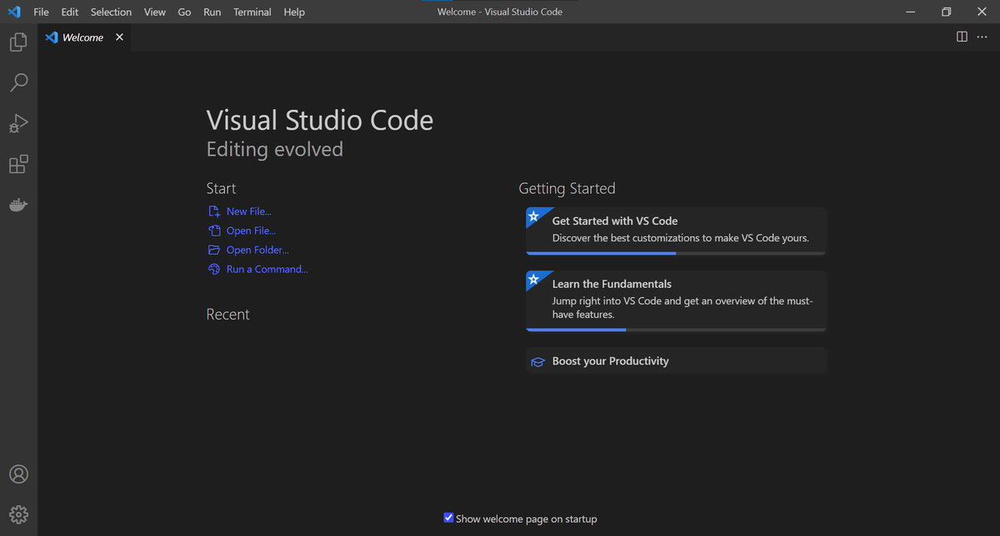

## Alapok

A [Visual Studio Code](https://code.visualstudio.com) egy könnyű, de sokoldalú nyílt forráskódú kódszerkesztő program, ami asztali alkalmazésként
fut. Telepíthető [Windows](#windows), [macOS](#macos) és [Linux](#linux) operációs rendszerekre. Beépített támogatása van JavaScript, TypeScrpt és Node.js nyelvekhez, 
ezenkívül [kiegészítők széles választéka](https://marketplace.visualstudio.com/VSCode) áll a felhasználók rendelkezésére, amik sok más nyelven is hatékonnyá
tehetik a fejlesztést.



## Telepítés

### Windows

- TODO

### macOS

1. Töltsd le a macOS csomagot [innen](https://code.visualstudio.com/Download)
2. A letöltéseid között keresd meg a fájlt.
3. Amennyiben archívum, bontsd ki.
4. Húzd a Visual Studio Code.app fájlt az Alkalmazások mappába.

### Linux

Amennyiben a parancsokban `<fajlnev>`, `<eleresi-utvonal>`, vagy hasonló részt látsz, helyettesítsd be értelemszerűen.

A telepítésről részletesebb leírást [itt](https://code.visualstudio.com/docs/setup/linux) találsz.


#### Debian/Ubuntu alapú rendszerek

1. Töltsük le a .deb csomagot a [hivatalos oldalról](https://code.visualstudio.com/Download)

2. Telepítsük a programot
    - A legtöbb rendszeren elegendő futtatni a .deb fájlt
    - Amennyiben nem tudjuk egyszerűen futtatni adjuk ki a következő parancsot rá:   
    ```
    sudo apt install ./<fajlnev>.deb
    ```

#### RHEL, Fedora, és CentOS alapú rendszerek

1. Vegyük fel a VS Code repository-t:  
```
sudo rpm --import https://packages.microsoft.com/keys/microsoft.asc
sudo sh -c 'echo -e "[code]\nname=Visual Studio Code\nbaseurl=https://packages.microsoft.com/yumrepos/vscode\nenabled=1\ngpgcheck=1\ngpgkey=https://packages.microsoft.com/keys/microsoft.asc" > /etc/yum.repos.d/vscode.repo'
```

2. Telepítsük a programot:  
```
dnf check-update
sudo dnf install code
```

#### Egyebek

Amennyiben a rendszered a fentiek között nem szerepel, megtalálod a megfejelő útmutatót a [VS Code hivatalos oldalán](https://code.visualstudio.com/docs/setup/linux).

## Beállítás
