## Bevezető

A [Visual Studio Code](https://code.visualstudio.com) egy könnyen használható, azonban sokoldalú, nyílt forráskódú kódszerkesztő program, amely asztali alkalmazásként fut. Telepíthető [Windows](#windows), [macOS](#macos), valamint [Linux](#linux) operációs rendszerekre. Beépített támogatása van JavaScript, TypeScript és Node.js nyelvekhez, illetve [kiegészítők széles választéka](#kiegészítők) áll a felhasználók rendelkezésére, amelyek sok más nyelven is hatékonnyá tehetik a fejlesztést.


## Telepítés

### Windows
    
1. Töltsük le a Visual Studio Code telepítőjét a [hivatalos weboldalról](https://code.visualstudio.com/download)!

2. A letöltést követően indítsuk el a telepítőt, majd kövessük a képernyőn megjelenő utasításokat!
    - Fogadjuk el a felhasználási feltételeket!

    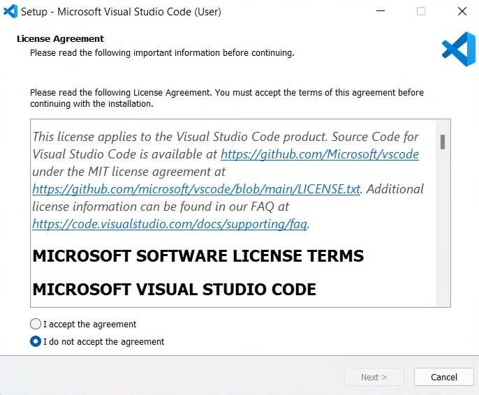

    - Válasszuk ki a telepítés helyét!

    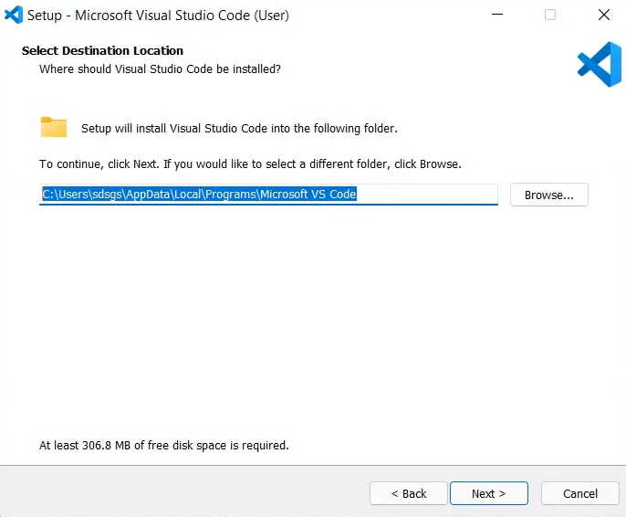

    - Amennyiben nem szeretnénk létrehozni parancsikont a Star Menu-ben, pipáljuk be a "Don't create a Start Menu folder" lehetőséget!
  
    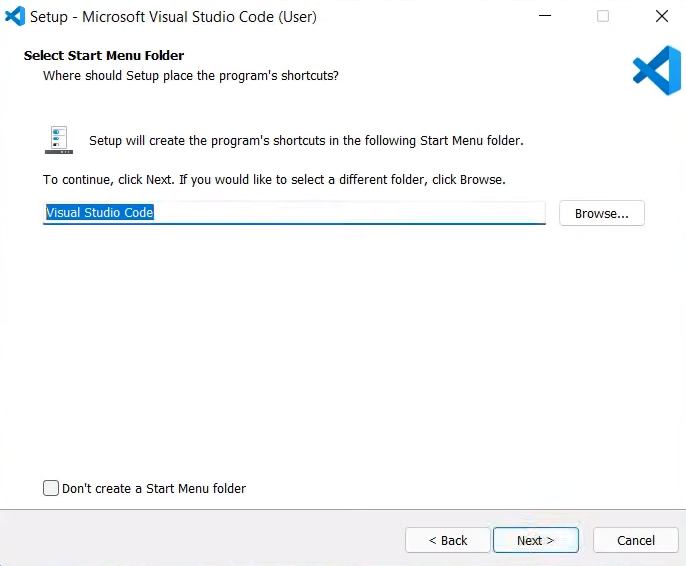

    - Válasszuk ki, hogy milyen beállításokkal szeretnénk telepíteni az alkalmazást!

    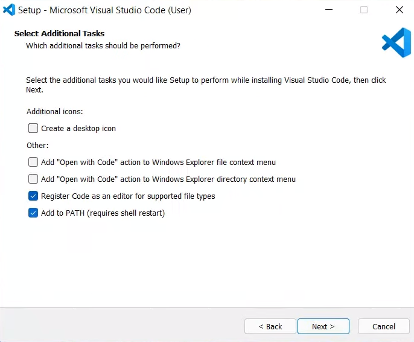

    - Ha minden beállítást elvégeztünk, a programtól kapunk egy összefoglalót. Amennyiben mindent megfelelőnek találtunk, elkezdhetjük a telepítést!

    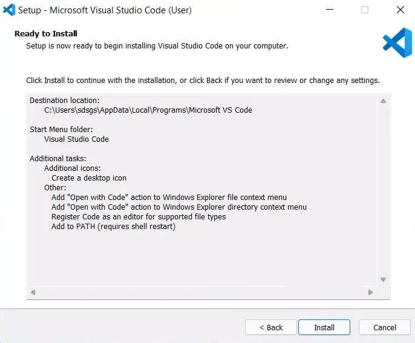

    - Amennyiben befejezés után szeretnénk elindítani a programot, pipáljuk be a "Launch Visual Studio Code" lehetőséget!

    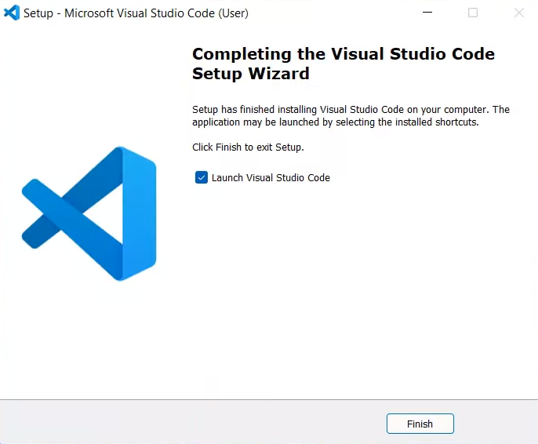

3. A program indításához kattintsunk az asztalon lévő Visual Studio Code parancsikonra, vagy futtassuk a telepítés helyén található .exe fájlt!

### macOS

1. Töltsük le a Visual Studio Code csomagot a [hivatalos weboldalról](https://code.visualstudio.com/download)!
2. A letöltést követően másoljuk át az alkalmazást az "Applications" mappába!
3. A program indításához kattintsunk az imént áthelyezett parancsikonra, vagy keressünk rá a program nevére Spotlight segítségével!

### Linux

#### Debian/Ubuntu alapú rendszerek

1. Töltsük le a Visual Studio Code .deb csomagját a [hivatalos weboldalról](https://code.visualstudio.com/download)!

2. A letöltést követően futtassuk a letöltött .deb fájlt! (Amennyiben a rendszerünk nem engedi, használjuk a következő parancsot: ```sudo apt install ./<fájlnév>.deb```)

#### RHEL, Fedora, és CentOS alapú rendszerek

1. A telepítés első lépéseként vegyük fel a Visual Studio Code repository-t, használjuk a következő parancsokat:
```
sudo rpm --import https://packages.microsoft.com/keys/microsoft.asc
sudo sh -c 'echo -e "[code]\nname=Visual Studio Code\nbaseurl=https://packages.microsoft.com/yumrepos/vscode\nenabled=1\ngpgcheck=1\ngpgkey=https://packages.microsoft.com/keys/microsoft.asc" > /etc/yum.repos.d/vscode.repo'
```

1. Indítsuk el a telepítést: 
```
dnf check-update
sudo dnf install code
```

#### Egyéb rendszerek

Amennyiben rendszered nem szerepel a fentiek között, a részletes telepítési útmutatót megtalálod a [Visual Studio Code hivatalos weboldalán](https://code.visualstudio.com/docs/setup/linux).

## Kiegészítők

Ahogy a bevezetőben már említettünk, a programhoz különféle kiegészítők készültek. Ezeknek fő célja, hogy egyszerűbbé tegyék a beépített nyelveken kívüli fejlesztést.

### Kiegészítők telepítése

   1. Válasszuk ki a program bal oldali sávjában található ```Extensions``` menüpontot!
   2. Keressünk rá a telepítendő kiegészítő nevére! 
   3. A találatok közül válasszuk ki a szimpatikus kiegészítőt, majd kattintsunk rá!
   4. A kiegészítő telepítéséhez nyomjunk rá az ```Install``` gombra!

## Beállítás Java fejlesztéshez

[Hivatalos Visual Studio Code dokumentáció](https://code.visualstudio.com/docs/languages/java)

Mielőtt nekifognánk a Visual Studio Code beállításának, telepítenünk kell a Java-t számítógépünkre. Ehhez nincs más dolgunk, mint ellátogatni a [Java hivatalos weboldalára](https://www.java.com/download/ie_manual.jsp), és letölteni a legfrissebb verziót.

Amennyiben ezzel készen vagyunk, fel kell telepítenünk a Java-hoz tartozó kiegészítő csomagot. A kiegészítők telepítéséről bővebben olvashatsz a [kiegészítők telepítése](#kiegészítők-telepítése) bekezdésben.


A kiegészítő beszerzése után, készen vagyunk a beállítással, hozzuk létre első Java projektünket!

Válasszuk ki a ```View``` menüben található ```Command Palette``` funkciót! (```[Ctrl + Shift + P]```)

Gépeljük be a ```Java: Create Java Project``` parancsot, majd válasszuk ki a projekt típusát!
    
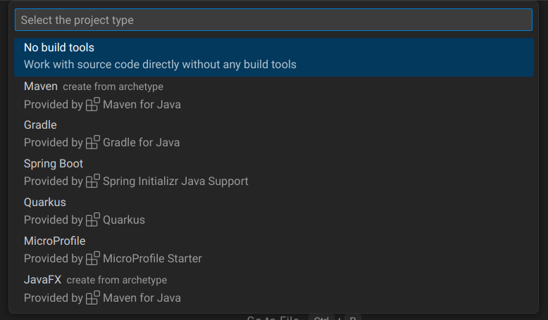

Adjuk meg, hogy hova szeretnénk létrehozni a projektet, valamint ezt követően írjuk be a projekt nevét!

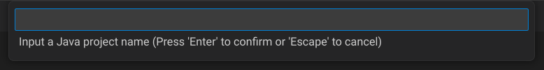

A program futtatásához kattintsunk a jobb felső sarokban található indítás gombra!

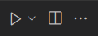

## Beállítás egyéb fejlesztéshez

### Python

[Hivatalos Visual Studio Code dokumentáció](https://code.visualstudio.com/docs/languages/python)

Első lépésként telepítenünk kell egy Python interpretert számítógépünkre. Ehhez nincs más dolgunk, mint ellátogatni a [Python hivatalos weboldalára](https://www.python.org/downloads), és letölteni a legfrissebb verziót.

Ezt követően fel kell telepítenünk a Visual Studio Code-hoz készült Python kiegészítőt. A kiegészítők telepítéséről bővebben olvashatsz a [kiegészítők telepítése](#kiegészítők-telepítése) bekezdésben.

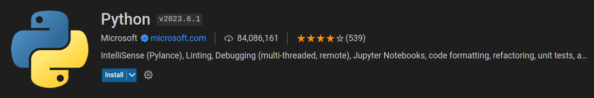

A kiegészítő beszerzése után, be kell állítanunk az imént feltelepített interpreter-t. Ezt a következőképpen tehetjük meg:
   1. Válasszuk ki a ```View``` menüben található ```Command Palette``` funkciót! (```[Ctrl + Shift + P]```)
   2. Írjuk be a ```Python: Select Interpreter``` parancsot, majd válasszuk ki a telepített interpreter-t a listából!

   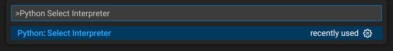

Miután végeztünk minden lépéssel, létrehozhatjuk első programunkat. Ehhez gépeljük be a ```Python: New Python File``` parancsot!

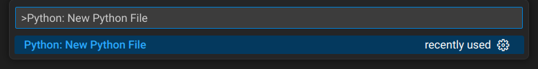

A program futtatásához kattintsunk a jobb felső sarokban található indítás gombra!


### C, C++

[Hivatalos Visual Studio Code dokumentáció](https://code.visualstudio.com/docs/languages/cpp)

A Java és Python nyelvekhez hasonlóan, a C és C++ futtatásához is szükségesünk van egy fordítóra. Ennek beszerzéséhez nincs más dolgunk, mint ellátogatni a [MinGW hivatalos weboldalára](https://www.mingw-w64.org/downloads), és letölteni a legfrissebb verziót.

A MinGW telepítése után, szükségünk van a C/C++ és Code Runner kiegészítőkre. A kiegészítők telepítéséről bővebben olvashatsz a [kiegészítők telepítése](#kiegészítők-telepítése) bekezdésben.

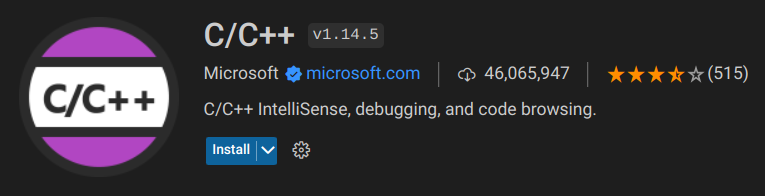

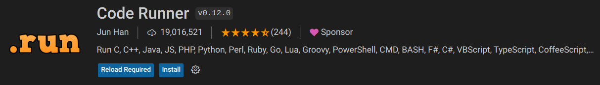

A kiegészítők beszerzése után, hozzuk létre első C vagy C++ programunkat!

Válasszuk ki a ```View``` menüben található ```Command Palette``` funkciót! (```[Ctrl + Shift + P]```)

Gépeljük be a ```Create: New File``` parancsot, majd adjuk meg a létrehozandó fájl nevét és kiterjesztését! (```.c```/```.cpp```)

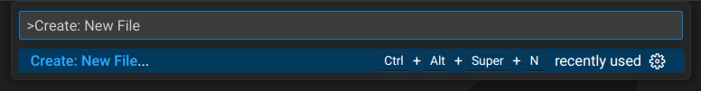

A program futtatásához kattintsunk a jobb felső sarokban található indítás gombra!


### C#

[Hivatalos Visual Studio Code dokumentáció](https://code.visualstudio.com/docs/languages/csharp)

fel kell teleoíteni a dotnet-et, link

extension
()

létrelehet hozni a következő paranccsal : dotnet new console -o <név>

nyissuk meg code-al a legenerált projektet

írjuk be a parancsot: >.NET: GEnerate Assets for Build and Debug
()

bal oldal run and debug majd kis nyíl
()

## Hasznos kiegészítők

Az eddig említett kiegészítőkön kívül, rengeteg olyan hasznos csomag létezik, amelyek még egyszerűbbé és gördülékenyebbé teszik a fejlesztés folyamatát.

### Better Comments

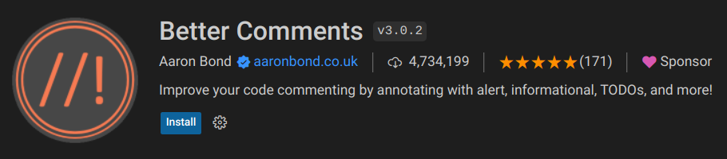

Lehetővé teszi a személyre szabott és interaktív megjegyzések létrehozását a kódban.

### Bookmarks

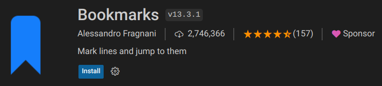

Lehetővé teszi a kód sorainak jelölését és navigációját.

### GitLens

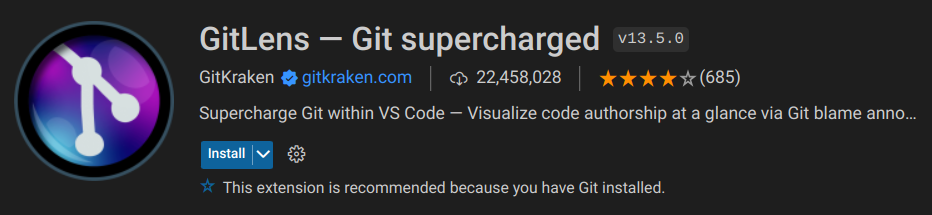

Bővíti a Git integrációt, lehetővé teszi a kód változásainak vizsgálatát és nyomon követését, valamint a szerzők és az időbélyegzők megjelenítését.

### Markdown All in One


Lehetővé teszi a Markdown szintaxis egyszerűbb használatát.

### Prettier

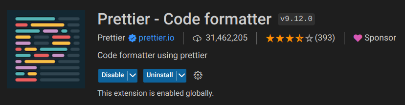

Lehetővé teszi a kód automatikus formázását a kiválasztott beállítások alapján.