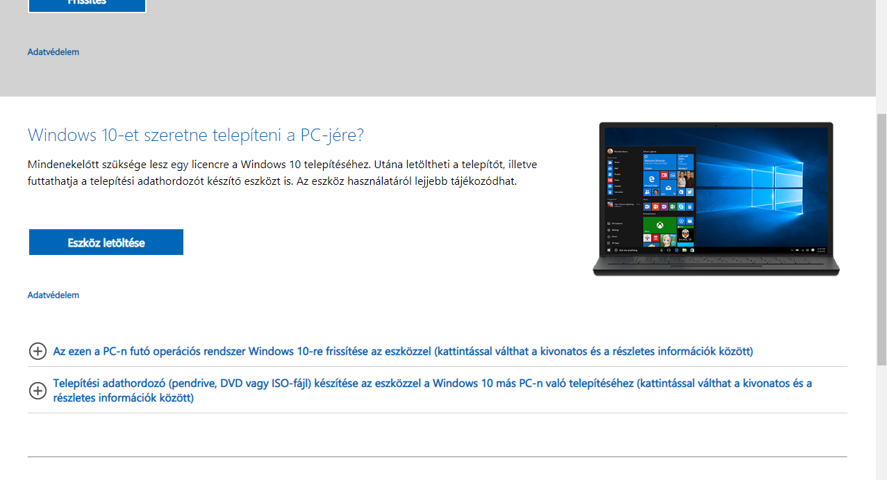
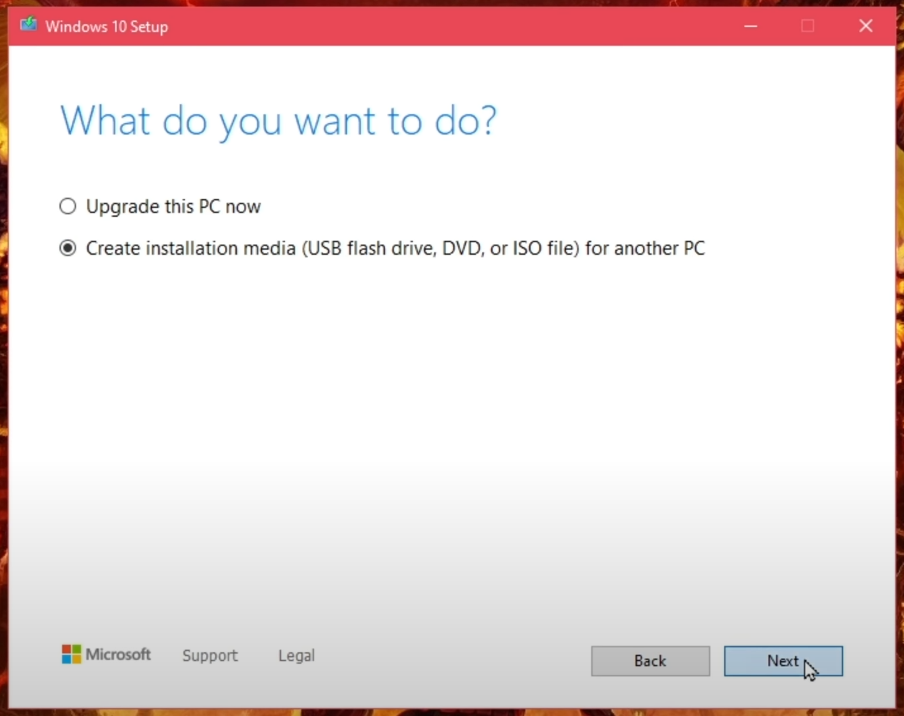

A Windows 10 az egyik legelterjedtebb operációs rendszer a világon, amit a Microsoft fejlesztett ki és adott ki 2015-ben. Azóta több frissítést kapott, így a rendszer folyamatosan fejlődik és új funkciókkal bővül.

## Gépigény

    - CPU: 1 gigahertz-es (GHz) vagy gyorsabb processzor vagy SoC (rendszerchip)
    - RAM: 1 gigabájt (GB) a 32 bites rendszerhez és 2 GB a 64 bites rendszerhez
    - Tárhely: 16 GB a 32 bites és 32 GB a 64 bites operációs rendszerhez
    - GPU: DirectX 9-kompatibilis vagy újabb, WDDM 1.0 típusú illesztőprogrammal
    - Minimum képernyőfelbontás: 800x600

# Telepítés

## Követelmények

    - Pendrive legalább 16GB szabad memóriával
    - Internetkapcsolat

## Windows 10 letöltése és boot-olható pendrive készítése

Boot-olható pendriveot kell készítenünk a telepítés megkezdése előtt. Ehhez van egy program ami letölti nekünk a kívánt verziójú és nyelvű Windows 10 telepítőt, majd egy pendrive-ra előkészíti nekünk a telepítőt.
Ezt az alkalmazást [hivatalos oldalról](https://www.microsoft.com/hu-hu/software-download/windows10) tudjuk beszerezni.



### Pendrive előkészítése

A program elindítása után el kell fogadnunk a felhasználási feltételeket, majd ki kell választanunk, hogy boot-olható pendriveot szeretnénk készíteni.



A következő képernyőn ki tudjuk választani, hogy milyen nyelvű és típusú Windows 10 rendszer telepítőt töltsön le a program.
Válasszuk ki a kívánt opciókat, majd válasszuk ki az USB tepeítőt.
Ezután egy ablakban ki tudjuk választani, hogy melyik betűvel ellátott tárolóra kívánjuk felrakni a telepítőt. Érdemes előtte meggyőzödni, hogy biztos a megfelelő eszköz van kijelölve.
A program ezt követően letölti a telepítőt és rárakja a pendrive-ra.

## Boot-olás pendrive-ról

- Csatlakoztassuk az USB meghajtót a számítógéphez

- Indítsuk újra a számítógépet, bizonyos esetekben be kell lépni a `BIOS`-ba hogy megváltoztassuk a boot prioritást (ezt az indulás követően az `F12` vagy a `DEL` billentyűk nyomogatásával érhetjük el), és az USB meghajtót elsődleges boot eszközként kell megadnunk.

- Válasszuk ki az USB meghajtót a boot eszközként (A pontos eljárás és az opciók a számítógép gyártójától és a BIOS/UEFI változatától függhetnek).

### Telepítés

Miután ezzel végeztünk kattintsunk az `Install now` gombra, és kezdjük meg a telepítést!


Az első ablakon egyből az aktiválással kezd a telepítő, ha van kódunk írjuk be, de skippelhejtük is ezt a lépést az `I dont have a productkey gombal` .


A felhasználói feltételek után válasszuk ki a `Custom intsall` lehetőséget.
Ezzel lehetőségünk nyílik egy teljesen "új, tiszta" telepítésre.
Fontos megjegyezni, hogy a telepíteni kívánt meghajtóról a fontos fájlokat mentsük le, mert formázni fogjuk telepítés előtt.


A kívánt meghajtóra nyomjunk egy formatot és ha szükséges, hozzunk létre új partíciót. Ezt a sárga ikon melletti `New` gombbal tehetjük meg.
A windows is létre szokott magának hozni külön paríciókat helyreállításnak és egyéb dolgoknak. Azokat ne piszkáljuk.
Ha minden megvan, akkor válasszuk ki a partíciót, és indítsuk el a tepeítést.

# Első indítás, beállítás

Telepítés után újra fog indulni a számítógép. Lépjünk be újra a `BIOS` -ba és állítsuk vissza a boot prioritást. (Ha a pedrvie eltávolítása után a telepített meghajtóról boot-ol a rendszer akkor nincs teendőnk.)

Első indításnál állítsuk be a kívánt nyelvet, billentyűzet kiosztást és az időzónát.
Majd kövessük a telepítő utasításait. Ha internet kapcsolatot használunk a beállítás során, akkor kötelezően bejelentkeztet vagy regisztráltat minket a Windows egy Microsoft fiókba.
Ha ezt el akarjuk kerülni, akkor inkább húzzuk ki az internet kábelt a gépből, vagy ne csatlakozzunk Wifi hálózathoz a beállítás alatt!

Ha internet nélkül teplepítettünk, akkor a drivereket magunknak kell letölteni.
Ebben segítséget nyújthat a [Driver Booster](https://www.iobit.com/en/driver-booster.php) nevű alkalmazás ami ingyenesen letölti és telepíti nekünk a szükséges drivereket.

    - Fontos megjegyezni, hogy a Driver Booster telepítőjében felajánl nekünk pár kiegészítő programot amiknek alapból elfogadásra van állítva a pipájuk. Ezeket nézzük át, és ne telepítsünk semmi plusz felesleges programot!

# Szoftverek telepítése és fejlesztői környezet kialakítása

Alapértelmezett alkalmazásokat a `Default apps` beállítás menüben tudjuk megváltozatni.
(Csak írjuk a start menü melletti szövegdobozba a beállítás nevét és nyissuk meg az első találatot)

- Képek hez az [IrfanView](https://www.irfanview.com/) alkalmazást tudom javasolni.
- Videók lejátszására pedig a [VLC](https://www.videolan.org/vlc/) a legnépszerűbb program.
- IDE -nek egy [Visual Studio Code](https://code.visualstudio.com/) is ajánlott lehet.

## Scoop

A Scoop egy nyílt forráskódú szoftvercsomag-kezelő alkalmazás a Windows operációs rendszerhez. A Scoop lehetővé teszi a fejlesztők és rendszergazdák számára, hogy könnyen telepítsenek és frissítsenek szoftvereket a parancssoros felületen keresztül.

A telepítséhez utasításokat ezen a [linken](https://scoop.sh/) találunk.

Egyszerűen telepíthetünk több programot egyszerre a parancssoron keresztül:

```sh
scoop install git llvm python nodejs
```
